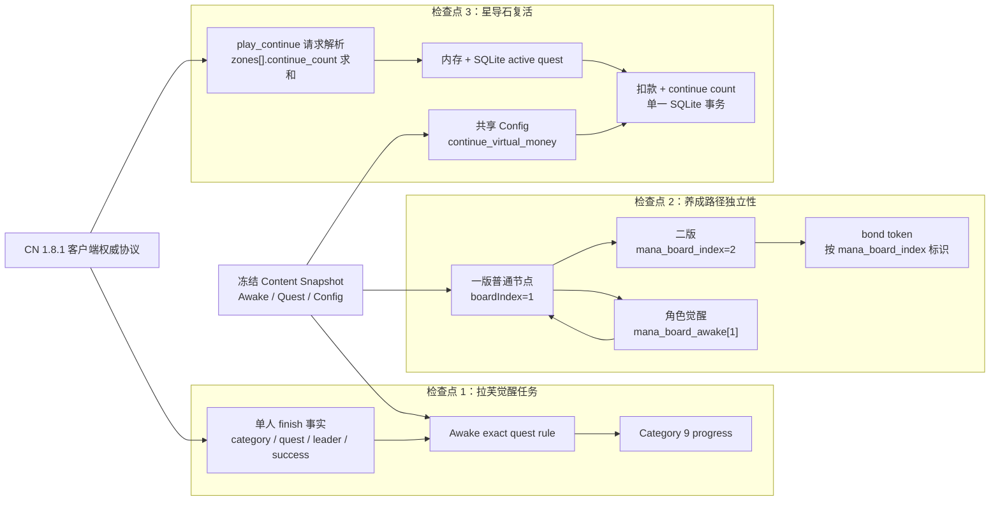
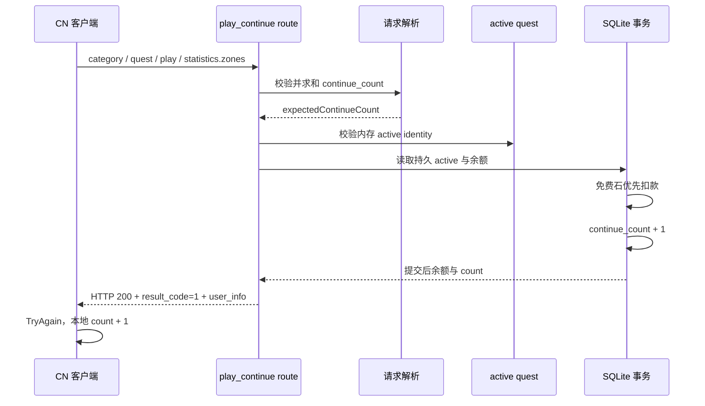

# 角色觉醒、玛纳板与单人复活 Gate 目标架构

设计状态：已批准，尚未实现。

## 1. 目标

本 Gate 在不修改 CN 1.8.1 客户端、不猜测未知业务码、不重构整个任务或战斗框架的前提下，完成三个顺序检查点：

1. 修正拉芙角色觉醒任务 `2630023` 的单人关卡与队长判定；
2. 固化一版、二版和角色觉醒三条养成路径的独立性，并覆盖两种完成顺序；
3. 对齐单人战斗失败后使用星导石复活的客户端请求协议与费用权威。

三个检查点属于同一 Gate，但各自独立执行聚焦 TDD、代码审查和本地提交。前一检查点未通过审查时，不进入下一检查点；整个 Gate 稳定后只运行一次带固定基线的广域验证，并使用受支持入口重启服务。

本 Gate 不新增数据库 schema，不修改 Player Save format，也不修改客户端资源。

## 2. 总体职责



### 边界

- 拉芙任务只修正客户端权威的 exact quest 事实，不改造通用 Awake computer。
- 二版与角色觉醒共享“一版普通节点完成”和基础等级事实，但互不作为对方的前置条件。
- 角色觉醒不是 `boardIndex=3`；它写入 `mana_board_awake[1]` 和一版节点的 `awake_level`。
- 复活请求解析与复活事务分离；请求解析只产生可信的 `expectedContinueCount`，不写数据库。
- 复活事务继续复用现有 active quest 身份、幂等重放和免费星导石优先扣款语义。

## 3. 检查点 1：拉芙觉醒任务

### 客户端权威事实

| 字段 | 权威值 |
|---|---:|
| 觉醒角色 | 拉芙 `263002` |
| Awake mission | `2630023` |
| 任务类型 | `battle_clear_count` |
| finish category | `18`（单人 `WorldStoryEvent`） |
| quest ID | `400001104`（女王拉芙，超级+） |
| 队长角色 | 贝瑞塔 `151006` |
| 队长来源 | `statistics.party.characters[0].id` |
| 联机边界 | 仅单人 |
| 完成边界 | `is_accomplished=true` |

`category=19` 表示 `WorldStoryEventBossBattle`，不是该单人挑战；`100100004` 和 `100401004` 也不是客户端为本任务提交的 quest ID。

### 判定

任务只在以下条件全部满足时增加 `2630023` 进度：

```text
questAccomplished = true
questCategory = 18
questId = 400001104
isMulti != true
party.characters[0].id = 151006
```

贝瑞塔仅出现在 unison、其他主位、全队任意位置或玩家全局 leader 字段中都不算满足任务。

### 写入链

```text
/single_battle_quest/finish
  -> recordMissionBattleFacts
  -> Awake exact quest rule
  -> Category 9 progress for mission 2630023
  -> mission/get_mission_progress 投影
```

本检查点不改变 Awake 最终奖励领取时序。当前“finish 自动推进 stage/发奖”与历史文档中的“回 Awake 第一页领奖”存在证据冲突；没有新的 CN 实机流量前不得猜测修改。

## 4. 检查点 2：一版、二版与角色觉醒

### 状态模型

| 路径 | 持久状态 | 前置条件 | 不得依赖 |
|---|---|---|---|
| 一版 | board 1 普通节点、board 1 bond token | 拥有角色、节点规则与资源 | 二版、Awake |
| 二版 | `mana_board_index=2`、board 2 节点、board 2 bond token | 稀有度、开放期、基础满级、一版普通节点、突破次数 | `mana_board_awake`、Awake mission stage |
| 角色觉醒 | `mana_board_awake[1]`、一版节点 `awake_level`、Awake unlock | 活动开放、基础满级、一版普通节点 | `mana_board_index=2`、二版节点、board 2 bond token |

### 必须支持的顺序

```text
顺序 A：一版完成 -> 角色觉醒完成 -> 打开二版
顺序 B：一版完成 -> 打开二版 -> 角色觉醒完成
```

两种顺序最终必须得到等价且可序列化的状态：

```text
mana_board_index = 2
mana_board_awake[1] = 当前觉醒等级
bond_token_list 同时包含 board 1 与 board 2 的唯一条目
一版 Awake 节点值不因二版打开而回退
二版节点不因 Awake 解锁而创建、删除或改写
```

### bond token 规则

- 数据库读取必须按 `mana_board_index` 稳定排序。
- 业务判定必须按条目的 `mana_board_index` 查找，不得把数组下标 `manaBoardIndex - 1` 当作身份。
- 反序插入、只有 board 1、缺少 board 2 和旧存档补建都必须有确定性行为。
- 每个 `(player, character, mana_board_index)` 只能有一条记录。

### 开板原子性

`open_mana_board` 的目标状态是角色 index、board 2 bond token 和同请求触发的任务写入全部成功，或全部不发生。必须通过故障注入验证：若后置任务结算失败，不能留下“二版已打开但请求报错”的半完成状态。

如现有实现已经满足该原子性，只增加回归测试；只有 RED 证明存在分裂提交时才调整事务 owner，不提前重构任务引擎。

### 响应边界

`/load`、`open_mana_board`、普通节点与 Awake 节点响应中的角色投影必须保持：

- `mana_board_index` 为整数 `1` 或 `2`；
- `mana_board_awake` 是以 board index 为键的整数映射；
- `bond_token_list` 通过字段标识 board，不依赖数组位置；
- 不生成 `mana_board_index=3` 或 Awake board 2/3。

## 5. 检查点 3：星导石复活

### CN 1.8.1 请求协议

客户端调用：

```text
POST /api/index.php/single_battle_quest/play_continue
```

关键 body：

```text
{
  category: int,
  quest_id: int,
  play_id: string,
  payment_type: 1,
  statistics: {
    zones: [
      { continue_count: int, ... },
      ...
    ],
    party: {...},
    ...
  },
  viewer_id: number,
  api_count: int,
  retry_count?: int
}
```

客户端不会发送 `statistics.continue_count`。只有最终 finish 请求存在与 `statistics` 平级的根级 `continue_count`。

### 请求解析

服务端必须从所有 zone 求得请求前的复活次数：

```text
expectedContinueCount = sum(statistics.zones[i].continue_count)
```

解析规则：

- `statistics` 必须是对象；
- `zones` 必须是非空数组；
- 每个 zone 必须是对象；
- 每个 `continue_count` 必须是非负 safe integer；
- 求和不得超过 `Number.MAX_SAFE_INTEGER`；
- 不接受自造的顶层 `statistics.continue_count` 作为兼容来源；
- 多 zone 必须求和，不能只读取第一个 zone。

解析成功后才进入 session、active quest、余额和扣款事务。

### 费用权威

费用来自共享配置：

```text
getConfigSync().continue_virtual_money
```

不得在 route 中硬编码 `50`。当前 bundled config 的值为 50，但测试必须使用非 50 的配置值证明 route 读取共享权威。

扣款顺序保持客户端语义：

```text
free_vmoney 优先
不足部分从 vmoney 扣除
```

### 事务与幂等



- 同一成功 payload 重放不得二次扣款。
- 重启后内存 count 落后于持久 count 时，合法重放恢复内存而不写库。
- active identity、持久 identity、请求 count 或余额不合法时不得发生部分写入。

### 错误边界

本 Gate 必须修复“合法客户端请求因错误字段位置必然 HTTP 400”的问题。

余额不足、active quest 不匹配等可预期业务失败长期应使用 HTTP 200 与官方非成功 `result_code`，因为客户端把非 200 视为传输错误；但当前没有这些分支的官方精确 result code，不得在本 Gate 猜码。相关负路径保留为后续协议取证项。

`battle_max_continue_count` 是服务端防篡改缺口，但当前服务端 Content 模型尚未提供该字段。客户端标准流程会在达到上限时直接 Withdraw，因此它不是本次首次复活 400 的根因；上限服务端校验延期到拥有权威字段后的独立工作。

CN 当前主数据未发现可用的 Continue 道具。`item/use_item` 不与星导石 `play_continue` 合并。

## 6. 测试与检查点提交

### 检查点 1

- Awake 纯规则正负例；
- 真实 single finish 到 Category 9 progress；
- 错误 category、quest、主位、unison、联机和失败结算不命中。

提交：`fix(awake): align Lavu challenge mission`

### 检查点 2

- 两种完成顺序；
- bond token 反序、缺行和补建；
- 二版与 Awake 状态互不改写；
- open_mana_board 后置失败回滚；
- load 与增量角色投影。

提交：`fix(character): keep mana board paths independent`

### 检查点 3

- 真实 CN `statistics.zones` 请求；
- 多 zone 求和和非法值；
- 首次扣款、混合余额、重放、重启恢复；
- 非 50 配置值；
- 成功响应及客户端可解析字段。

提交：`fix(quest): align single battle continue protocol`

### Gate 收尾

- 更新角色觉醒、玛纳板和单人战斗 current 文档；
- 为新文件和测试补 changed-file selector；
- typecheck、docs、hygiene、diff check；
- 只运行一次带 Gate 基线的广域验证；
- 使用 `scripts/start-cn.sh` 重启并检查健康状态；
- 不 push，等待客户端实机验收。

提交：`docs: finalize character growth and continue gate`

## 7. 实机验收

1. 贝瑞塔主位通关女王拉芙超级+后，`2630023` 进度完成；
2. 一版完成后先完成角色觉醒，再打开二版；
3. 一版完成后先打开二版，再完成角色觉醒；
4. 两种顺序重登后状态一致；
5. 战斗全灭后第一次、第二次星导石复活成功；
6. 免费星导石足够、免费不足需补付费两种扣款均正确；
7. 复活后继续战斗、最终 finish 与重登状态一致。

## 8. 延期项

- Awake 奖励是 finish 自动领取还是回页面领取，等待新的 CN 流量证据；
- 服务端按 `battle_max_continue_count` 强制上限，等待 Content 权威字段；
- 复活业务失败的官方 `result_code`；
- Continue 道具；
- 无关的任务引擎、战斗统计和角色成长框架重构。
