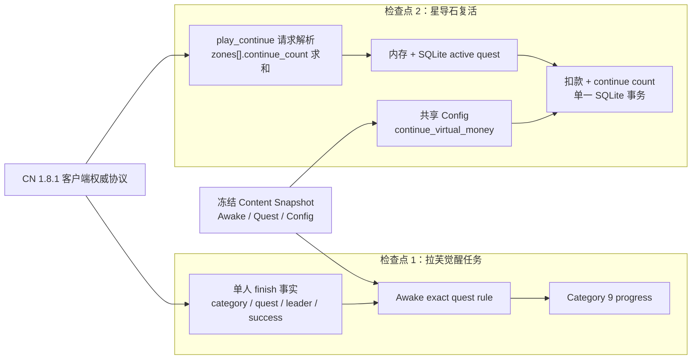
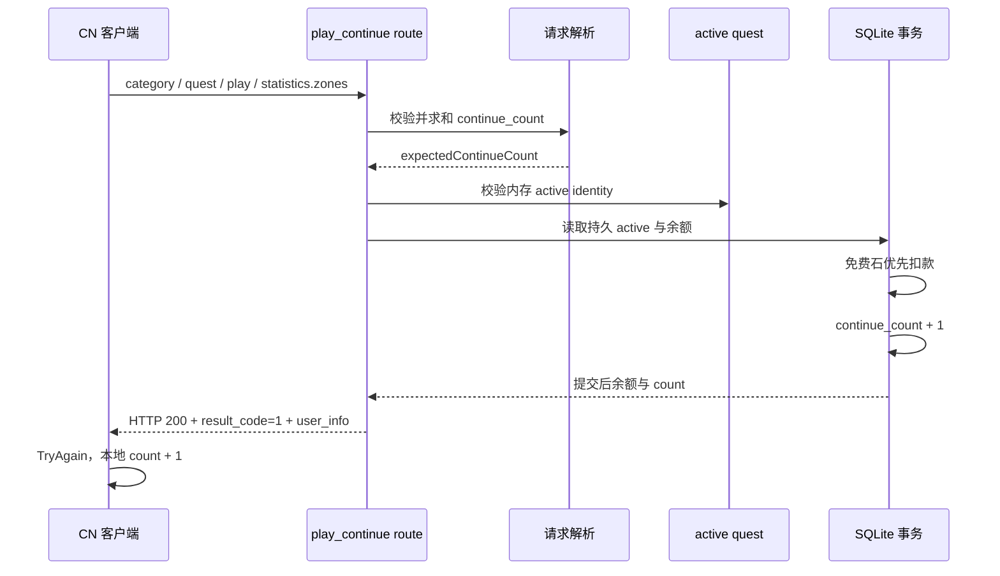

# 拉芙觉醒任务与单人复活 Gate 目标架构

实现状态：已实现，等待客户端实机验收。以下请求、判定和费用边界是当前实现口径；服务端自动验证已经完成，但拉芙任务与单人复活的 CN 客户端实机验收尚未完成。

## 1. 目标

本 Gate 在不修改 CN 1.8.1 客户端、不猜测未知业务码、不重构任务或战斗框架的前提下，完成两个顺序检查点：

1. 修正拉芙角色觉醒任务 `2630023` 的单人关卡和队长判定；
2. 对齐单人战斗失败后使用星导石复活的客户端请求协议与费用权威。

两个检查点各自执行聚焦 TDD、代码审查和本地提交。检查点 1 未通过审查时不进入检查点 2；整个 Gate 稳定后只运行一次带固定基线的广域验证，并使用受支持入口重启服务。

本 Gate 不新增数据库 schema，不修改 Player Save format，不修改客户端资源。

一版、二版和角色觉醒三条养成路径的独立性、完成顺序、bond token 顺序以及二版开板事务边界不进入本 Gate，改为后续独立 Gate。

## 2. 总体职责



### 边界

- 拉芙任务只修正客户端权威的 exact quest 事实，不改造通用 Awake computer。
- 复活请求解析与复活事务分离；请求解析只产生可信的 `expectedContinueCount`，不写数据库。
- 复活事务继续复用现有 active quest 身份、幂等重放和免费星导石优先扣款语义。
- 不顺带修改二版、Awake 节点、bond token、任务领奖时序或多人复活。

## 3. 检查点 1：拉芙觉醒任务

### 客户端权威事实

| 字段 | 权威值 |
|---|---:|
| 觉醒角色 | 拉芙 `263002` |
| Awake mission | `2630023` |
| 任务类型 | `battle_clear_count` |
| finish category | `18`（单人 `WorldStoryEvent`） |
| quest ID | `400001104`（女王拉芙，超级+） |
| 队长角色 | 贝瑞塔 `151006` |
| 队长来源 | `statistics.party.characters[0].id` |
| 联机边界 | 仅单人 |
| 完成边界 | `is_accomplished=true` |

`category=19` 表示 `WorldStoryEventBossBattle`，不是该单人挑战；`100100004` 和 `100401004` 也不是 CN 1.8.1 客户端为本任务提交的 quest ID。

### 判定

任务只在以下条件全部满足时增加 `2630023` 进度：

```text
questAccomplished = true
questCategory = 18
questId = 400001104
isMulti != true
party.characters[0].id = 151006
```

贝瑞塔仅出现在 unison、其他主位、全队任意位置或玩家全局 leader 字段中都不算满足任务。

### 写入链

```text
/single_battle_quest/finish
  -> recordMissionBattleFacts
  -> Awake exact quest rule
  -> Category 9 progress for mission 2630023
  -> mission/get_mission_progress 投影
```

本检查点不改变 Awake 最终奖励领取时序。当前“finish 自动推进 stage/发奖”与历史文档中的“回 Awake 第一页领奖”存在证据冲突；没有新的 CN 实机流量前不得猜测修改。

### 测试边界

- 正例：`category=18`、`questId=400001104`、贝瑞塔位于 `party.characters[0]`、单人、成功结算；
- 负例：category 19、错误 quest、贝瑞塔仅在 unison、贝瑞塔不是主位 0、联机、战斗失败；
- 集成：真实 single finish 后 Category 9 的 `2630023` 进度增加并能由 `mission/get_mission_progress` 投影；
- 不允许只修改纯规则测试而不覆盖 finish 事实写入链。

提交：

```text
fix(awake): align Lavu challenge mission
```

## 4. 检查点 2：星导石复活

### CN 1.8.1 请求协议

客户端调用：

```text
POST /api/index.php/single_battle_quest/play_continue
```

关键 body：

```text
{
  category: int,
  quest_id: int,
  play_id: string,
  payment_type: 1,
  statistics: {
    zones: [
      { continue_count: int, ... },
      ...
    ],
    party: {...},
    ...
  },
  viewer_id: number,
  api_count: int,
  retry_count?: int
}
```

客户端不会发送 `statistics.continue_count`。只有最终 finish 请求存在与 `statistics` 平级的根级 `continue_count`。

### 修复前根因

修复前服务端强制读取 `statistics.continue_count`。对 CN 1.8.1 标准请求，该字段为 `undefined`，因此在 session、active quest、余额和扣款检查之前稳定返回 HTTP 400 `Invalid request body`。

修复前路由测试也自造了同一个错误顶层字段，并有源码结构断言锁定该读取路径，形成“自造请求满足自造校验”的错误闭环。

### 请求解析

服务端必须从所有 zone 求得请求前的复活次数：

```text
expectedContinueCount = sum(statistics.zones[i].continue_count)
```

解析规则：

- `statistics` 必须是对象；
- `zones` 必须是非空数组；
- 每个 zone 必须是对象；
- 每个 `continue_count` 必须是非负 safe integer；
- 求和不得超过 `Number.MAX_SAFE_INTEGER`；
- 不接受自造的顶层 `statistics.continue_count` 作为兼容来源；
- 多 zone 必须求和，不能只读取第一个 zone。

解析成功后才进入 session、active quest、余额和扣款事务。

### 费用权威

费用来自共享配置：

```text
getConfigSync().continue_virtual_money
```

不得在 route 中硬编码 `50`。当前 bundled config 的值为 50，但测试必须使用非 50 的配置值证明 route 读取共享权威。

扣款顺序保持客户端语义：

```text
free_vmoney 优先
不足部分从 vmoney 扣除
```

### 事务与幂等



- 同一成功 payload 重放不得二次扣款。
- 重启后内存 count 落后于持久 count 时，合法重放恢复内存而不写库。
- active identity、持久 identity、请求 count 或余额不合法时不得发生部分写入。

### 成功响应

成功响应保持 HTTP 200、Base64(MsgPack)：

```text
data_headers.result_code = 1
data.user_info.free_vmoney = 扣款后免费星导石
data.user_info.vmoney = 扣款后付费星导石
data.mail_arrived = 当前未领取邮件状态
```

客户端收到成功响应后才在本地执行 `TryAgain` 并增加战斗内 continue count。

### 错误边界

本 Gate 必须修复“合法客户端请求因错误字段位置必然 HTTP 400”的问题。

余额不足、active quest 不匹配等可预期业务失败长期应使用 HTTP 200 与官方非成功 `result_code`，因为客户端把非 200 视为传输错误；但当前没有这些分支的官方精确 result code，不得在本 Gate 猜码。相关负路径保留为后续协议取证项。

`battle_max_continue_count` 是服务端防篡改缺口，但当前服务端 Content 模型尚未提供该字段。客户端标准流程会在达到上限时直接 Withdraw，因此它不是本次首次复活 400 的根因；上限服务端校验延期到拥有权威字段后的独立工作。

CN 当前主数据未发现可用的 Continue 道具。`item/use_item` 不与星导石 `play_continue` 合并。

### 测试边界

- 真实 CN `statistics.zones` 请求，且 `statistics` 没有顶层 `continue_count`；
- 单 zone 首次扣款；
- 多 zone `[1,0,1]` 求和为 2；
- zone count 缺失、负数、小数、字符串和 safe-integer 求和溢出；
- 成功 payload 重放不重复扣款；
- 正常重启恢复后的重放；
- 免费星导石足够、免费不足由付费补足；
- 非 50 配置值；
- 成功响应能被客户端公共响应层接受。

提交：

```text
fix(quest): align single battle continue protocol
```

## 5. Gate 收尾

- 更新角色觉醒任务与单人战斗 current 文档；
- 为新文件和测试补 changed-file selector；
- typecheck、docs、hygiene、diff check；
- 只运行一次带 Gate 基线的广域验证；
- 使用 `scripts/start-cn.sh` 重启并检查健康状态；
- 不 push，等待客户端实机验收。

提交：

```text
docs: finalize awake mission and continue gate
```

## 6. 实机验收

1. 贝瑞塔主位通关女王拉芙超级+后，`2630023` 进度完成；
2. 战斗全灭后第一次和第二次星导石复活成功；
3. 免费星导石足够时只扣免费石；
4. 免费星导石不足时先清空免费石，再从付费石补足；
5. 复活后能继续战斗并完成 finish；
6. 重登后余额、关卡进度和 active quest 状态一致。

## 7. 后续独立 Gate

以下内容已完成客户端与服务端预审，但不进入本 Gate：

- 一版、二版和角色觉醒的双向独立性；
- `一版 -> Awake -> 二版` 与 `一版 -> 二版 -> Awake` 两种完成顺序；
- bond token 查询排序与按 `mana_board_index` 查找；
- 反序、缺行和旧存档补建；
- 二版打开与后置任务结算的事务原子性；
- `/load` 与增量角色投影的一致性；
- Awake 奖励是 finish 自动领取还是回页面领取的实机取证。

该后续 Gate 必须单独设计、单独计划、单独广域验证，不与本 Gate 的 exact mission 和 Continue 协议修复混合。

## 8. 其他延期项

- 服务端按 `battle_max_continue_count` 强制上限，等待 Content 权威字段；
- 复活业务失败的官方 `result_code`；
- Continue 道具；
- 无关的任务引擎、战斗统计和角色成长框架重构。
