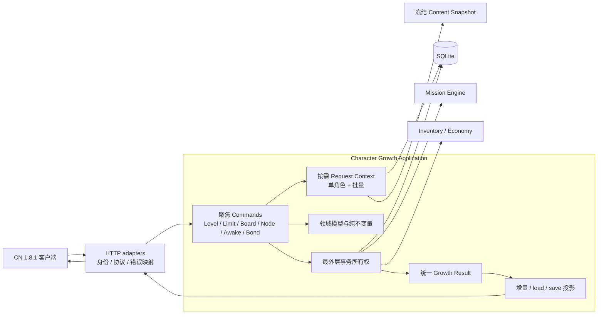

# D14 统一角色成长状态服务目标架构

状态：设计已通过，尚未实施。本文件定义 D14 在同一 Gate 内直接落地完整 Character Growth Application Service 的目标架构、迁移阶段、性能合同和测试可达性。C1-C6 是同一架构目标的内部迁移阶段，不是可单独交付的过渡版本；在全部阶段实现并完成验证前，不得把本文描述成当前运行行为。

## 1. 背景

CN 1.8.1 客户端把普通一版、普通二版和 CharacterAwake 视为共享一版前置、彼此独立的两条后续成长路径：

```text
                 ┌─ 普通二版：等级上限 + 一版全节点 + 突破次数 + 开放期
一版全节点 ──────┤
                 └─ CharacterAwake：等级上限 + 一版全节点 + Awake 活动和任务
```

二版不检查 Awake 状态；Awake 不检查 `mana_board_index=2` 或二版节点。用户重新尝试“先完成 Awake、再操作二版”也没有复现历史报错，因此 D14 不把状态耦合作为已证实根因。

当前服务端仍存在结构性分散：角色基础成长、普通板、节点、Awake、bond token、任务事实、响应投影、`/load` 和存档分别在路由、数据层、任务 helper 和序列化代码中推导。静态审计已经确认：

1. bond token 查询未稳定排序，部分业务按数组下标识别板；
2. `open_mana_board` 先提交板索引与 token，之后才结算任务，可能半提交；
3. 运行时使用 `mana_board_awake:{}` 表示删除，但客户端只做 map merge，空对象不会清除旧缓存；
4. v2 存档没有按角色 Content 校验普通板、Awake 和 token 的业务范围；
5. 相同成长不变量在路由、任务、存档和响应层存在重复实现，后续继续补丁会扩大状态漂移风险。

D14 不再先交付小型方案 A。它直接建立统一角色成长应用服务，并在 C1-C6 阶段中迁移全部目标调用点、删除旧实现；只有全部阶段完成后才形成本文定义的可交付架构。

## 2. 客户端权威事实

### 2.1 普通板

- 一版完成只检查一版 Content 的全部 node ID 是否已经存在于玩家节点集合，不比较节点 Awake level；
- 二版开启要求基础等级上限、一版全节点、稀有度对应突破次数和开放期；
- 普通板请求使用 `character/open_mana_board` 与 `character/learn_mana_node`；
- 客户端只发送角色和 node IDs，不发送自报费用或库存；
- 服务端必须使用持久状态和冻结 Content 重新计算。

### 2.2 CharacterAwake

- Awake 入口只要求 Awake event、基础等级上限、一版全节点和角色 Awake 任务；
- `character/awake_mana_node` 固定处理普通一版节点的 Awake level；
- Awake 不改变普通 `mana_board_index`，普通二版也不是 Awake 前置。

### 2.3 增量合并

客户端对 `mana_board_index` 和 `mana_board_awake` 使用可选字段合并：字段缺失保持旧值；普通板索引存在时覆盖；Awake map 存在时复制旧 map 并按键覆盖。由此得到：

- Awake 响应省略普通板索引不会把二版降回一版；
- `mana_board_awake:{}` 不会删除客户端已有 `{1:1}`；
- 正常增量只能省略 Awake 字段，或发布新增/提高后的正整数键值。

## 3. D14 范围

### 3.1 统一服务拥有的状态与行为

Character Growth 成为以下状态的唯一普通业务所有者：

- 角色 EXP 与等级计算；
- 角色重复获得形成的 `stack`，以及 Growth command 对 stack 的消费；
- `over_limit_step`；
- `evolution_level`；
- 普通 `mana_board_index`；
- 普通玛纳节点；
- 节点 `awake_level`；
- CharacterAwake 解锁；
- 每板 bond token status；
- 角色成长产生的任务事实；
- 角色成长字段的 CN 增量响应投影；
- `/load` 的 Growth 完整投影；
- v2 存档的 Growth 导入、导出和终态校验；
- 管理端整包恢复之后的权威 Growth 读取边界。

### 3.2 独立 collaborator

统一 Growth 不吞并相邻领域：

- Mission Engine 负责候选、事实求值、stage、receipt 和任务奖励；Growth 发布事实并在自己的外层事务中调用结算；
- Inventory/Economy 负责道具、玛纳和货币写入；Growth 产生并提交经过校验的资源计划；
- Content Snapshot 提供冻结的角色、板、节点、费用和开放期事实；Growth 不复制 Content；
- HTTP adapter 负责 session、viewer、MsgPack、状态码和字段名；领域层不依赖 Fastify；
- Equipment、EX Boost、配队、active quest 和通用 RewardGrant 保持独立，除非实施审计证明某个写入与 Growth 当前事务不可分割；出现这种新证据时必须停下更新设计，不能静默扩张。

### 3.3 明确延期

- D15 库存响应一致性；
- 道具 `max_count`、超限邮件和活动期限；
- Awake 奖励在 finish 或页面领取的官服时序；
- 普通第三板、Awake level 2 或未知未来系统；
- 数据库 schema migration 和旧玩家歧义状态自动修复；
- 跨进程数据库事务或远程数据库抽象。

## 4. 总体架构



统一服务是一个由聚焦函数模块组成的应用层，不是容纳全部逻辑的巨型 class。路由只进行协议适配；command 负责用例；纯领域模块负责不变量；transaction owner 负责原子写入；projector 负责客户端字段。

## 5. 目标目录

```text
src/lib/character-growth/
├── model.ts
├── errors.ts
├── invariants.ts
├── content-facts.ts
├── request-context.ts
├── batch-context.ts
├── repository.ts
├── transaction.ts
├── result.ts
├── response-projector.ts
├── load-projector.ts
├── facts/
│   ├── mission-growth-facts.ts
│   └── awake-unlock-facts.ts
├── commands/
│   ├── open-mana-board.ts
│   ├── receive-bond-token.ts
│   ├── learn-mana-nodes.ts
│   ├── awake-mana-nodes.ts
│   ├── grant-character-exp.ts
│   ├── inject-exp.ts
│   ├── over-limit.ts
│   ├── bulk-over-limit.ts
│   └── convert-character-stack.ts
└── save/
    ├── validate-growth-state.ts
    └── project-growth-state.ts
```

文件应按实际职责继续拆分，避免任何单文件成长为新的综合路由。只允许真实 command 使用的抽象进入目录；不增加 generic command bus、event bus、依赖注入容器或插件注册表。

## 6. 领域模型

领域模型不引用 Fastify、MsgPack 或客户端 DTO。

```ts
type BondTokenStatus = 0 | 1 | 2

interface CharacterGrowthCoreFact {
    readonly playerId: number
    readonly characterId: number
    readonly rarity: number
    readonly exp: number
    readonly stack: number
    readonly overLimitStep: number
    readonly evolutionLevel: number
    readonly manaBoardIndex: number
}
```

普通节点、Awake unlock、bond token 和资源是独立 section，不构造所有请求都必须完整加载的 eager aggregate。

```ts
interface CharacterGrowthSections {
    readonly bondTokens?: ReadonlyMap<number, BondTokenStatus>
    readonly normalManaNodes?: ReadonlyMap<number, number>
    readonly awakeUnlocks?: ReadonlyMap<number, number>
    readonly requiredItems?: ReadonlyMap<number, number>
}
```

Content facts 与玩家持久状态分开：

```ts
interface CharacterGrowthContentFacts {
    readonly boardCount: number
    readonly boardNodeIds: ReadonlyMap<number, ReadonlySet<number>>
    readonly secondBoardAvailable: boolean
    readonly requiredExp?: number
    readonly requiredOverLimitStep?: number
}
```

领域 map 以数字 board/node ID 为键；客户端数组和字符串对象键只在 projector 边界生成。

## 7. 按需读取与 repository

### 7.1 单角色 request context

```ts
interface CharacterGrowthRequestContext {
    character(): CharacterGrowthCoreFact
    bondTokens(): ReadonlyMap<number, BondTokenStatus>
    normalManaNodes(): ReadonlyMap<number, number>
    awakeUnlocks(): ReadonlyMap<number, number>
    requiredItems(ids: readonly number[]): ReadonlyMap<number, number>
    contentFacts(): CharacterGrowthContentFacts
}
```

- section 第一次调用时批量读取，后续复用；
- 未调用 section 不产生 SQL；
- 写入后用明确 after-state 替换缓存，或只失效受影响 section；
- 不使用跨请求全局玩家状态缓存；
- Content 来自当前冻结 snapshot，不在 command 内重新解析 JSON。

### 7.2 批量 context

`/load`、mission 和 save 不循环调用单角色 context。batch context 对目标角色集合按表各读取一次，再按 `character_id` 内存分桶。SQL 数量不得随角色数增长，只有返回行数线性增长。

### 7.3 repository

`repository.ts` 是当前 SQLite 的具体 Growth 数据适配器，不为不存在的第二数据库提前定义通用 repository interface。它集中：

- targeted core/section reads；
- batch reads；
- token、节点、Awake 和角色字段写入；
- 稳定排序和原始行到领域值的边界验证。

所有 token 查询按 `character_id, mana_board_index` 稳定排序，但业务正确性依赖 keyed map，不依赖 SQL 顺序。

## 8. 纯不变量

### 8.1 普通板

- 普通板索引只能单调增加；
- 正常开板只能从当前板到下一板；
- 目标板必须存在于角色 Content；
- 二版要求基础等级上限、一版全节点、突破次数和开放期；
- Awake 不参与二版 eligibility；
- 精确 `targetBoard == currentBoard` 只作为提交成功但响应丢失后的重放，幂等返回当前状态；
- 降级、跳板和不存在板均 400、零写入。

### 8.2 bond token

- 业务身份是 `mana_board_index`，数组只用于升序投影；
- status 只允许 `0→1→2`；
- 尚未完成的目标/未来板缺行可安全补为 0；
- 当前事务刚完成某板且该行缺失时，可用当前转移证据插入 1；
- 已完成历史板缺行无法判断从未领取还是领取记录损坏，返回 `INVALID_GROWTH_STATE`，不得猜成 1 或 2；
- status 2 重放不得重复增加 bond currency。

### 8.3 普通节点与 Awake 节点

- 请求 node 必须属于 command 目标板；
- parent、等级、重复节点和费用在任何写入前全量验证；
- 同一批相同材料先聚合，资源结果使用最终绝对数量；
- 普通节点只增加存在性，Awake level 只增加；
- board completion 与 token earned 在同一 command transaction；
- `evolution_level` 由真实节点状态推导，不由客户端自报。

### 8.4 Awake 解锁

- 合法解锁一旦持久化，运行时永久有效；
- 当前 eligibility 不满足只表示本次不新增，不撤销历史解锁；
- 正常业务不提供删除接口；
- `mana_board_awake:{}` 不再作为删除响应；
- Awake 不改变普通板索引，普通开板不删除 Awake。

### 8.5 EXP、stack、突破与进化

D14 迁移现有已实现规则，不借统一服务改变费用、上限或客户端协议。角色没有独立的 `level_up` 或 `evolve` 请求：客户端通过 `/expod/inject_exp` 注入 EXP，其他 EXP 来自现有奖励入口；`evolution_level` 由节点状态推导。stack 来自重复角色，并由突破或 `/expod/stack_to_exp`、`/expod/bulk_stack_to_exp` 消费。相关 command 必须在写前生成完整计划，资源、角色字段和任务事实同一事务提交；重复或陈旧请求不能倒退状态。

## 9. Commands

每个 command 接受业务身份和客户端真实提交字段，不接受 Fastify request/reply。

### 9.1 `executeReceiveBondTokenSync`

事务内重新读取玩家 bond currency 与目标 token：status 0 拒绝；status 1 同时增加货币并更新为 2；status 2 幂等成功、零写入。

### 9.2 `executeOpenManaBoardSync`

事务内校验角色、Content、当前板、等级、突破和前板节点；补建无歧义 token；更新板索引；结算 category 1；形成 after-state。

### 9.3 `executeLearnManaNodesSync`

复用现有 Mana Mutation Plan 中已验证的节点、parent、等级、资源和 evolution 计算；command 负责读取范围、资源最终值、节点写入、token earned、任务事实和响应结果的原子协调。迁移后 route 不再直接持有数据库写入。

### 9.4 `executeAwakeManaNodesSync`

复用现有 Awake 费用和节点规划；固定处理普通一版；在同一事务中扣资源、更新节点 Awake level、发布完成状态和任务事实，不改变普通板索引。

### 9.5 EXP、stack 与突破 commands

迁移 `/expod/inject_exp`、`/character/over_limit`、`/character/bulk_over_limit`、`/expod/stack_to_exp` 和 `/expod/bulk_stack_to_exp` 的现有行为，并为战斗/奖励授予角色 EXP、重复角色增加 stack 提供同一 Growth 入口。它们使用统一 result 和错误分类，EXP pool、星粒、突破道具等相邻资源由同一最外层事务协调。`evolution_level` 不建立不存在的客户端 command，只由节点 command 和合法性修复共享同一推导函数。若 EX Boost 在实施核对后仍是独立事务和状态，则不纳入；不得仅因命名属于角色而扩张。

### 9.6 明确迁移的客户端入口

| 路由 | Growth 职责 |
|---|---|
| `/character/receive_bond_token` | token 领取与 bond currency 幂等事务 |
| `/character/open_mana_board` | 普通板开启、token 与 category 1 事务 |
| `/character/learn_mana_node` | 普通节点、资源、evolution、token 与任务事实 |
| `/character/awake_mana_node` | Awake 节点、资源、完成状态与任务事实 |
| `/character/over_limit` | 单角色 stack/item 突破事务 |
| `/character/bulk_over_limit` | 官方客户端批量突破范围内的批量 Growth 事务 |
| `/expod/inject_exp` | EXP pool 消费、角色 EXP 与任务事实 |
| `/expod/stack_to_exp` | 单角色 stack 转换及相邻资源事务 |
| `/expod/bulk_stack_to_exp` | 官方客户端批量 stack 转换及相邻资源事务 |

`set_protection`、`set_illustration_settings`、配队与 EX Boost 不属于本 Gate 的 Growth command。角色首次获得仍由角色拥有权/RewardGrant 入口负责，但重复角色形成 stack 必须通过统一 Growth 写入边界，不能继续由各奖励入口自行更新。

## 10. Mission 与外部入口

Growth 负责形成成长事实，Mission 负责求值和奖励。外部入口不能继续直接删除、插入或校准 Growth 表。

迁移范围包括当前真实会产生 Growth/Awake publication 的 single finish、multi finish、mission receive、mail、shop、gacha、item sell、story、tutorial 等 owner。调用方式统一为：

```text
外部入口持有或加入最外层事务
  → 提交明确 Growth facts / candidate character IDs
  → Growth 计算单调状态变化
  → Mission 使用 request-scoped facts 求值
  → 统一结果并入调用方响应
```

Mission 不维护另一套一版完成、Awake 解锁或 bond identity 公式。现有 21 个 Awake owner 场景继续保留行为与结构 admission；迁移结束后删除旧 runtime delete 和重复 reconciliation helper。

## 11. 事务、幂等与错误

### 11.1 最外层事务

一个 command 涉及的角色字段、节点、token、Awake、资源、任务进度、receipt 和奖励必须由同一个最外层 SQLite transaction 覆盖。内部 `settleMissionCategories` 可使用 savepoint，但不能提前提交。

### 11.2 网络恢复

SQLite 与 HTTP 发送不能形成同一分布式事务。事务提交后才投影和发送；发送失败由精确 command 重放幂等恢复。开板与 token 领取重放零重复写入、零重复奖励。

### 11.3 错误分类

稳定领域 code 至少包括：

```text
CHARACTER_NOT_OWNED
BOARD_NOT_AVAILABLE
LEVEL_REQUIRED
OVER_LIMIT_REQUIRED
PREVIOUS_BOARD_INCOMPLETE
BOND_TOKEN_NOT_EARNED
UNKNOWN_NODE
PARENT_NOT_LEARNED
ALREADY_LEARNED
INSUFFICIENT_ITEM
INSUFFICIENT_MANA
INVALID_GROWTH_STATE
CONTENT_INVALID
```

正常业务拒绝映射为当前有限 400；持久状态和 Content 自相矛盾映射为有限 500。日志只记录稳定 code、player/character/board、请求数量和安全 reason，不记录 session、device、完整请求、完整存档或全量库存。

## 12. 统一结果与响应投影

command 返回协议无关的 Growth result：

```ts
interface CharacterGrowthCommandResult {
    readonly command: string
    readonly before: CharacterGrowthObservedState
    readonly after: CharacterGrowthObservedState
    readonly changedNodeIds: readonly number[]
    readonly resourceState?: CharacterGrowthResourceState
    readonly missionSettlement?: MissionSettlementResult
    readonly replayed: boolean
}
```

字段只包含该 command 实际观察或改变的 section，不强制加载完整玩家。`response-projector.ts` 统一生成：

- `character_list` 中的 Growth 字段；
- `bond_token_list`；
- `mana_board_index`；
- `mana_board_awake`；
- `user_character_mana_node_list`；
- 资源、evolution 和 mission 增量。

projector 不访问数据库。`result.after`、事务提交后的 DB、端点响应、模拟客户端 merge 和下一次 `/load` 必须一致。

## 13. `/load` 与存档

### 13.1 `/load`

`load-projector.ts` 使用 batch context 构造所有角色的权威 Growth 完整快照。不得逐角色查询；不得把非法 DB 值夹紧后继续隐藏。发现明确非法持久状态时使用有限错误和安全日志，不静默改写。

### 13.2 v2 导入

基础结构校验后、任何写入前执行 Content-aware Growth 终态校验：

- `mana_board_index` 是安全整数、至少 1、不超过角色实际板数；
- token 引用存档内角色，板索引合法、status 为 0/1/2、组合不重复；
- Awake 引用存档内角色，当前只允许 board 1 和受支持正整数 level；
- 节点属于该角色 Content，Awake level 合法；
- 角色基础 Growth 数值符合当前既有边界。

非法导入整体失败，不夹紧、不静默删除、不部分写入。D14 不从当前等级或节点反推并降级历史合法板/Awake；只拒绝明确非法结构、范围和引用。

### 13.3 导出和管理操作

导出使用统一 Growth save projector。管理端整包恢复仍是显式管理操作，不冒充普通业务状态转移；在线客户端必须通过重新 `/load` 获取替换后的完整权威状态。

## 14. 性能目标

统一服务必须达到当前 SQLite 单进程架构下的逻辑单一权威与结构性能最优，而不是无条件加载全部成长状态。

### 14.1 单角色命令

- SQL 数量不随玩家拥有角色总数增长；
- 只加载该 command 声明的 section；
- 同一 section 每请求最多真实加载一次；
- Content 使用冻结内存 snapshot；
- 节点与材料按集合批量读取和写入，不允许每节点 SQL；
- 精确重放写入数为 0。

### 14.2 批量场景

- `/load`、mission 和 save 按表批量读取目标角色集合；
- SQL 数量不随角色数量线性增长；
- 任务事实 loader 按事实种类加载，不按任务数加载；
- response projector 不读数据库。

### 14.3 写后读取

能从 plan 确定 after-state 时使用内存结果；外部 collaborator 可能产生额外 Growth 状态时，只允许一次有明确 reason 的受影响 section 写后重读。不得为了少一条 SQL 牺牲状态正确性，也不得默认全量重读。

### 14.4 结构 admission

每个真实热路径记录 SQL reads/writes、每表 statements、section loader、mission compute、DB 后态和 response 行为 hash。行为必须匹配批准合同，结构指标保持或低于预算；新增业务表读取、重复 loader、N+1 或重放写入直接失败。墙钟时间只作观察，不作为受机器负载影响的唯一证据。

## 15. 测试可达性原则

所有测试先标注场景来源：

| 标签 | 含义 | 默认深度 |
|---|---|---|
| `CN-reachable` | CN 1.8.1 官方客户端正常流程可达 | 真实 Fastify、SQLite、MsgPack、DB/响应/`load` 端到端 |
| `transport-replay` | UI 不主动产生，但响应丢失或重试可达 | 真实路由、事务、幂等与零重复写入 |
| `server-boundary` | 只能绕过官方客户端直接调用 | 纯 command/validator 完整边界 + 少量代表 HTTP 映射 |
| `save-integrity` | 存档、管理操作或数据库损坏可达 | 导入/领域边界与全回滚，不模拟官方客户端 |
| `client-characterization` | 锁定反编译确认的客户端语义 | 最小 reducer 表征，不复制整套客户端 |

官方客户端不可能产生的状态仍需 fail closed，但不得伪装成客户端功能场景，也不得与每个 endpoint、每个非法值组成集成测试笛卡尔积。纯逻辑已穷举同一不变量时，HTTP 层只保留证明 adapter 未绕过校验的代表用例。

## 16. 关键测试矩阵

### 16.1 `CN-reachable`

- 当前客户端允许的等级、突破、进化、普通节点和 Awake 节点正常流程；
- 一版完成后开启二版；
- board 1/2 完成并领取 token；
- 拉芙“一版→Awake→二版”和“一版→二版→Awake”；
- 每步 DB、Growth result、端点响应、模拟客户端 merge 和最终 `/load`一致。

两种拉芙顺序最终必须满足：普通板 index 2；一版节点 Awake level 1；二版节点 Awake level 0；Awake `{1:1}`；两板 token 2；bond currency 各只增加一次；Category 9 状态一致。

### 16.2 `transport-replay`

- 开板提交成功后精确重放，零新写入、零重复任务奖励；
- token 领取重放，currency 不重复增加；
- 其他现有客户端 command 只在其协议存在可识别重放身份时声明幂等，不为未知协议猜 request ID。

### 16.3 `server-boundary`

非法 board、node、status、类型和 ownership 的完整矩阵放在纯 validator/command 测试；HTTP 只保留代表映射。客户端按钮锁定时不会发送的一版未完成开二版、board 3、降级、status 0 领取等不得描述成正常客户端流程。

### 16.4 `save-integrity`

覆盖非法普通板、token、Awake、node、基础 Growth 数值、重复组合和未知角色引用；证明写入前整体拒绝、原 DB 不变。反序 token 行属于读取稳定性，不属于客户端异常流程。

### 16.5 `client-characterization`

至少锁定 Awake map merge：旧 `{1:1}` 加省略字段保持；加 `{}` 仍保持；旧空 map 加 `{1:1}` 得到解锁。其他客户端表征只在协议字段确有合并歧义时增加。

### 16.6 事务故障注入

对角色字段、token、节点、资源、mission progress、stage receipt、奖励和 Awake unlock 的写入分别注入失败；逐表证明 command 所有写入回滚。故障注入是服务端事务证据，不宣称客户端主动制造数据库错误。

### 16.7 性能与等价性

- request context section 只加载一次；
- 未声明 section SQL 为 0；
- 单角色 command 无全玩家读取；
- `/load` 与 mission 无 N+1；
- 迁移前后既有 `CN-reachable` 行为等价，明确修复项除外；
- 现有 Awake 21-owner、Mission session、Mana batch write 和数据库索引性能合同继续通过。

## 17. 未复现问题的诊断

普通/Awake 节点 command 记录有限拒绝日志：route、playerId、characterId、持久普通板索引、领域错误 code 和请求 node 数量；可以记录单个失败 node/item ID，不记录完整 node list、全量库存、session 或 device。该日志只帮助区分材料、玛纳、节点归属、parent、重复、Content 和存档问题，不预判库存分叉为根因。

## 18. 同一 Gate 的迁移检查点

### C1：领域核心与性能合同

建立 model、errors、invariants、按需单角色/batch context、Content facts、具体 SQLite repository 和结构 admission。此检查点不改变协议；新增代码是最终架构，不是 facade。

### C2：bond token 与普通开板

迁移 token earned/receive、`open_mana_board`、category 1 settlement、keyed identity、缺行边界和精确重放。路由退出业务写入。

### C3：普通节点与 Awake 节点

迁移两个节点 command，复用已正确 Mana planner，统一资源、节点、evolution、token、任务事实和响应结果事务。删除对应路由内写入。

### C4：EXP、stack、突破与进化推导

迁移 inject EXP、单次/批量 over limit、单次/批量 stack 转换、奖励 EXP 与重复角色 stack 写入；`evolution_level` 继续由统一节点推导，不虚构客户端 evolve command。保持官方客户端协议和现有费用/上限。实施核对后仍独立的 EX Boost 不纳入。

### C5：外部 owner 与任务事实

迁移真实 Growth/Awake publication owners，统一事实和单调解锁，保留外部领域自己的最外层业务事务。删除 runtime Awake 删除和重复 reconciliation。

### C6：统一投影、`/load`、存档与清理

迁移 CN 增量 projector、batch load projector、v2 Growth 校验/投影和管理恢复边界；删除旧 helper、数组位置判断、空对象清理和临时 adapter。完成两顺序、诊断、文档和性能报告。

C1-C6 必须顺序迁移并保持每个阶段可验证；具体执行与验证编排只记录在版本库外实施计划与执行账本中，不进入本架构契约。

## 19. 规模与完成标准

客户端不可达场景不再扩写为过量集成测试后，预计生产代码变更约 2,500-4,500 行，测试与基础设施约 2,500-4,500 行，文档约 500-1,000 行，总 diff 约 6,000-10,000 行；如果真实调用面扩大，必须报告并重新确认范围，不能用测试删减掩盖生产复杂度。

D14 只有同时满足以下条件才完成：

- C1-C6 全部迁移，没有方案 A facade 或临时双写；
- Growth 目标状态只有一个普通业务所有者；
- 所有目标路由退出直接 Growth 表写入；
- bond token 全面 keyed、升序投影、幂等领取；
- 普通板、节点、Awake、EXP、stack、突破和 evolution 推导使用统一 command/result；
- 开板、节点、资源和任务具有批准的最外层事务；
- Awake 解锁永久单调，不再发布 `{}`伪删除；
- Mission 和外部 owner 使用统一 Growth facts；
- 增量响应、DB、客户端 merge、`/load` 和 save 使用同一状态模型；
- v2 明确非法 Growth 终态写入前拒绝；
- 真实热路径无 N+1、无无关 eager load、section 每请求最多加载一次；
- `CN-reachable`、重放、事务、存档、客户端表征和性能证据分别成立；
- 与变更范围相称的自动验证证明类型、文档、事务、协议、性能和客户端可达流程满足本文合同；
- 明确标注服务端自动 Gate 不替代 CN 客户端实机验收。

## 20. 主要现状证据路径

| 事实 | 路径 |
|---|---|
| 当前角色基础与路由入口 | `src/routes/api/character.ts`、`src/routes/api/character/` |
| 当前 bond 与开板 | `src/routes/api/character/bond.ts` |
| 当前普通/Awake 节点 | `src/routes/api/character/mana.ts`、`src/routes/api/character/mana-awake.ts` |
| 当前 Mana planner | `src/lib/character-mana-mutation-plan.ts`、`src/lib/character-mana-mutation-validation.ts` |
| 当前 Growth 数据读取 | `src/data/domains/character.ts`、`src/data/domains/character_awake.ts` |
| 当前 Awake reconciliation | `src/lib/mission/awake-unlock.ts`、`src/lib/mission/awake-unlock-response.ts` |
| 当前 request context | `src/lib/mission/awake-request-context.ts` |
| 当前 mission transaction | `src/lib/mission/settlement.ts` |
| 当前 load 投影 | `src/data/utils/serialize-player.ts`、`src/data/utils/player-data.ts` |
| 当前 v2 save | `src/data/player-save/v2.ts`、`src/data/utils/deserialize-player.ts` |
| 当前外部 owner 证据 | `tools/awake_reconcile_callsite_matrix.test.cjs`、`tools/perf/awake_owner_focused_baseline.test.cjs` |
| 当前性能与事务证据 | `tools/character_growth_transaction.test.cjs`、`tools/character_mana_batch_writes.test.cjs`、`tools/perf/awake_request_context_admission.test.cjs`、`tools/mission_regular_session_scope.test.cjs` |
