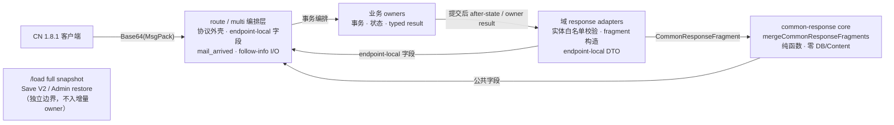

# D28 Common Response 字段级 Projector

状态：C1–C6 已实施。C1–C5 各波次 scoped review 已批准；C6 完成 DEBT-T07 字段 characterization、依赖方向守卫、性能 admission 与本文档。DEBT-T07 已按退出条件关闭。payload build 时间 admission 存在 residual（见「性能准入」）。待 Gate D 唯一 broad、`5620e86a..HEAD` whole-range final review 与服务重启（C7）；此前不宣称 Gate D 收口。

## 目标

D28 只统一「已完成事务产生的 owner result 如何投影、组合成客户端响应」，不统一业务 owner、事务或数据库写入。公共 projector 是无状态纯函数层：数据库查询与写入数为 0、不读取 Content、不获得 Fastify request/reply、不拥有 transaction。协议外壳（`{data_headers,data}`、错误码、HTTP/MsgPack 编码）与 endpoint-local 玩法字段继续由各 route/域 adapter 负责。

## 七个公共字段与合并代数

`src/lib/common-response/`（`model.ts` / `merge.ts` / `clone.ts` / `entities.ts` / `acquisition.ts`）实现有限 `CommonResponseFragment` 与 `mergeCommonResponseFragments()`：

| 字段 | 合并语义 | 空值/缺失语义 |
|---|---|---|
| `user_info` | 字段级覆盖（absolute Optional patch） | missing=保持；不得凭空补 0 |
| `item_list` | Item ID → after-count key 级后写覆盖 | `{}`=本请求无 Item 更新，不清背包 |
| `character_list` | 按 `character_id` 定位、字段一层覆盖、首现位置稳定 | `[]`=无更新；`mana_board_awake` 仅按板位 key 合并 |
| `equipment_list` | 按 `equipment_id` 定位、字段一层覆盖 | `[]`=无更新；最终 wire 实体必须五字段完整 |
| `mission_info` | 有序 append，不去重不排序 | 按端点既有合同 |
| `over_max` | 有序 append，只来自真实 overflow disposition | 无处置=字段缺失 |
| `mail_arrived` | 最后 concrete boolean | 由协调层传入，projector 禁查 Mail DB |

CN 1.8.1 客户端语义已特征化固定于 `tools/debt_t07_field_characterization.test.cjs`：字段缺失与显式 `null` 都解析为 `Option.None`（不更新本地状态）；empty collection 是 `Option.Some(empty)`（apply 只迭代传入集合，不清空仓库）；`0`/`false` 是合法 concrete；`user_info: {}` 是有效的 Some(empty) refresh。core 不全局归一化 `null`/缺失/`{}`/`[]`——Star/Bond 显式 `null` 与 Gacha Exchange character 分支 `item_list: []` 保持原 wire 形状（SHAPE_FROZEN，`tools/exchange_response_projection.test.cjs`、`tools/gacha_response_projection.test.cjs`）。

## owner → adapter → projector

已迁移入口（公共字段经 fragment 组合）：Shop、普通/Crazy/Exchange Gacha、Star Crumb、Bond Token、Mail、Gift、Item、Equipment、Sell、PassCard、ActiveMission、Tutorial、Single finish/abort/start、Multi finish/start、party、Story、Raid、Rush、Box Gacha、Mission claim/Awake、Growth（character/bond/mana/mana-awake/expod）、EX Boost、Profile、Quest Unlock、encyclopedia（仅 `mail_arrived`）、`/load` login/event-login Mission 组合。

## DEC-02 与 DEC-16 落地

- **DEC-02（AcquisitionOutcome / `over_max`）**：`src/lib/common-response/acquisition.ts` 把 D17 `RewardGrantExecutionResult` 的 `playerAfter`/`assets`/overflow dispositions 投影为绝对 Item/Currency/entity fragment；`over_max` 唯一协议 adapter 仍是 `src/lib/item-overflow/common-response.ts`。没有共同资产状态 owner；projector 不重新计算 cap 或 disposition。
- **DEC-16（Common Response typed field-wise projector）**：owner absolute after-state + Optional missing 保持原值 + request-scoped changed-node/bond delta 留在 Growth adapter，由 `mergeCommonResponseFragments()` 做有限字段级合并。不建立万能 serializer，不做 whole-aggregate replace，不回读数据库。

## DEBT-T07（已关闭）

「跨域客户端 DTO 重复」（见 [reward-grant-core-gate](./reward-grant-core-gate.md)）由公共字段 characterization + 域内最小 adapter case 替代：

1. 公共字段 characterization——`tools/debt_t07_field_characterization.test.cjs`（9 test：absolute、Optional missing、explicit null、empty、map/entity merge、nested delta、`over_max`、`user_info:{}` refresh），另有 `tools/common_response_projector.test.cjs`（merge 代数）、`tools/common_response_entities.test.cjs`（实体白名单/完整性）、`tools/common_response_acquisition.test.cjs`（owner result 投影）。
2. 域内最小 adapter case——`tools/shop_response_projector.test.cjs`、`tools/gacha_response_projection.test.cjs`、`tools/exchange_response_projection.test.cjs`、`tools/growth_response_projection.test.cjs`、`tools/single_finish_response_projector.test.cjs`、`tools/mission_response_fragment.test.cjs`、`tools/multi_response_projection.test.cjs`。
3. C6 重复 fixture survey：无可证明满足「公共 suite 完整覆盖 + 域内保留最小 adapter case」双重条件的可删 fixture（C5 迁移时已删除生产端重复 DTO 拼装；route/事务/rollback/wire-shape suite 按边界保留），删除数为 0，处置记录在仓库外 C6-2 报告。

## 依赖方向（守卫与已知例外）

`tools/architecture_dependencies.test.cjs` 固定三个静态守卫：

1. **前向闭包白名单**：`src/lib/common-response` 全部文件的传递 runtime 闭包只允许 core 自身与 4 个纯 helper（`item-overflow/common-response.ts`、`item-overflow/disposition.ts`、`inventory/mana-capacity-plan.ts`、`reward-grant/projection.ts`）。DB、Content、route、业务 owner 任何新增边 fail。
2. **零外部 runtime import**：闭包内不得 import Fastify、数据库 driver 或任何非相对模块。
3. **反向直接禁止**：`src/data/**` 与 typed owner result/contract 模块（mission settlement、shop result、reward-grant execution-*、item-overflow disposition、growth commands）不得直接 import `src/lib/common-response/*`。

已知例外（D28 前已批准、不在本 Gate 重构）：`src/lib/character.ts → character-growth/response-projector`（D23 结果投影）与 `src/data/utils/serialize-player.ts → character-growth/load-projector`（KEEP_LOAD）使 owner/data 世界传递加载域 projector，后者自 C5c 起内部使用公共 core。`src/data/utils/player-data.ts` 的 mana-board 纯函数已抽到 `src/lib/character-mana-board-maps.ts`（零依赖叶子），消除 data 层经 `character-helpers` 到 core 的传递路径。

## 兼容 facade（residual）

`src/lib/mission/response.ts::mergeMissionSettlementResponse` 仍服务 6 个调用点（`src/routes/api/equipment.ts` ×2、`singleBattleQuest.ts` /start、`party.ts` /update、`raidEvent.ts` /finish、`characterElection.ts` /vote）：base 缺键且 settlement 列表为空时不得引入 `character_list: []`/`equipment_list: []` 空键（wire 形状变化需用户批准，D28 无获批变化）。三分支行为由 `tools/mission_response_merge.test.cjs` 特征化。删除条件：批准相应 wire 变化后改直连 `composeMissionSettlementResponse`。

## Load / Save / Admin 保留边界

- `/load` full snapshot 与 `src/data/utils/serialize-player.ts` 是完整存档投影（KEEP_LOAD），不按增量 response 处理；login/event-login Mission 组合复用 C4 fragment adapter（`src/lib/mission/response-fragment.ts`），pending encoder 的事务/编码 rollback 时序留在 endpoint-local。
- Save V2、Admin CRUD/restore、`web_api/*`、`src/data/utils/deserialize-player.ts` 是存档完整性边界（KEEP_SAVE_ADMIN），不迁入 Common Response owner。
- CDN 与 Multi TCP transport 不是 HTTP MsgPack response owner。
- Equipment 全仓响应（如 `/bulk_upgrade`）继续由 endpoint/orchestration 完整读取后交给 projector，D28 不改 touched-only。

## 性能准入

- **硬门禁（全部通过）**：Pure Common merge 与 acquisition projector 的 instrumented DB probe 精确为 0；五个代表 endpoint（Shop /buy、Gacha /exec、Single /finish、Multi /finish、Equipment /bulk_upgrade）与 `/load` 代表路径的精确 Select/Write/Transaction 与 D28_BASE 逐项一致（23/14/5/4、24/13/7/4、56/33/15/8、88/55/25/8、25/12/9/4、135/78/35/22/0）；MsgPack 字节逐项一致（45/546/750/710）。
- **residual**：payload build 时间相对 D28_BASE 的 20% 容差未通过——同负载对照下代码归因回归 +226%~356%（mission/gacha/shop 三 fixture，绝对量级 10~27µs/build），归因于类型化实体校验与输入/输出隔离（B0-14 clone 不变量）的固有成本。查询计数零容忍不受影响。处置（接受并重定基线，或授权专项优化）记录在仓库外 D28 C6-4 报告，待 Gate D 审查决议。

## 明确排除

- 万能 Response/Economy/Player service 或任意字段深合并器；
- projector 读取/写入数据库、Content、Mail、Mission 或 Growth 状态；
- 把 `degree_list`、`active_mission_list`、EX/Event/Battle/Gacha/Shop 专属字段塞入公共 core；
- 将 Load full snapshot、Save、Admin restore 与增量 response 合并为同一 owner；
- 未经用户批准的协议形状变化（含 facade 调用点空键引入）。
