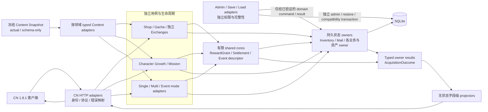

# D15 全项目领域边界蓝图

状态：D15 边界识别、决策和后续实施路线已经完成并通过独立审查；D16–D22 与大 Gate A/B 已完成，D23 Character Growth、D24 Mission Owner、D25 Battle Settlement 与 D26 Event Lifecycle 有限核均已完成，大 Gate C 已收口。D27 whole-range review 与 D28 Common Response Projector C1–C7、Gate D closure 均已完成（见 [Common Response Projector Gate](./common-response-projector-gate.md)）。D16–D28 已落地边界以对应 Gate 文档、本文状态行和代码为准。

## 1. 目标与证据纪律

D15 的目标不是把相似代码移动到同一目录，而是依据三类相互约束的证据确定领域边界：

1. CN Content 的 actual 类型、引用、时间和分类字段说明哪些业务定义确实存在；schema-only 字段不自动进入实现。
2. CN 1.8.1 客户端的 Values、Repository/Logic、Remote 和响应合并链说明正常入口、前置约束、独立生命周期与字段语义。
3. 服务端持久状态、最终 writer、外层事务和调用链说明谁可以成为 owner，哪里只能是 adapter、shared core 或 projector。

任何单层证据都不足以建立跨域 owner：

- 相同 Content 字段不等于相同事务；
- 相同客户端 DTO 不等于相同状态所有权；
- 相同服务端 helper 不等于相同生命周期；
- 官服行为无法再验证时，必须保留 `Official-Unknown` 来源限制，并把私服处置明确标为策略，而不是改写成官服事实。

## 2. 目标总体边界



图中的 shared core 只能协调已经由各 owner 验证的操作，不能成为新的持久状态中心。Projector 只能消费 typed result，不能回读数据库、开启事务或修复业务状态。

Admin/save/load 到 SQLite 的独立事务路径不是普遍绕过领域 owner 的许可，而是保留 DEC-18 已确认的权限、完整性、损坏存档、round-trip、V2 restore 总事务和 compatibility repair 边界。只有已经明确分配并验证的状态写入才经对应 domain command/result 收口；当前后续主线中的该类收口仅包括 D23 对 Character 持久状态越权 direct writer 的处理，不能扩大为全项目 admin/save/load owner convergence。

## 3. 持久状态与用例 owner

| 边界 | 唯一拥有的状态或用例 | 必须委托的协作者 | 明确不拥有 |
|---|---|---|---|
| Inventory | Item 数量、持有上限、实际入库量、累计获得量和 Item 有效性策略 | typed Item Content、Mail disposition、Currency owner adapter（EventTrade 到期转换）、来源用例 adapter | Mail 生命周期、Character、Equipment、Currency、奖励来源 |
| Mail | 邮件创建、分页、领取、过期、通知计数和领取历史 | Inventory/Character/Equipment/Currency owner adapters | Item cap 算法、奖励资产状态、来源商店或任务状态 |
| Shop | 产品、开放期、库存/次数、single/bulk purchase plan 与购买事务 | Inventory、Mail、Equipment enhancement、typed Shop Content | Star Crumb、Bond Token、Gacha Exchange 生命周期 |
| Gacha | banner、payment、draw、history、point 与 Gacha 域内 exchange | Item ticket、Currency、Character、Equipment owner adapters | Character/Equipment 最终状态、跨域 Exchange engine |
| Star Crumb Exchange | 自己的产品选择、开放期、资格、成本与原子交换事务 | Inventory、Mail、Character、Equipment、结果 projector | Shop/Bond/Gacha 的状态和错误语义 |
| Bond Token Exchange | 自己的产品、成本、库存/周期与原子交换事务 | Bond Token/user-info、Equipment、Ability Soul、typed Content | Character Growth 的 `receive_bond_token` 产出链 |
| Character Growth | 每个玩家角色的成长 aggregate、普通板、Awake、EXP、突破和相关成长结果 | Inventory/Currency、Mission facts、typed Growth Content、独立入口 adapters | Mission 状态、Bond Token Exchange、Equipment 生命周期 |
| Mission | catalog、candidate、fact evaluation、progress/stage、receipt 与奖励协调 | Growth/Battle/Inventory/Event 等来源事实、RewardGrant | 来源领域状态和永久 Awake 状态 |
| Single Battle | start、active identity、finish、continue、abort 与外层结算事务 | 有限 settlement primitives、Mission/Growth/Event adapters | Multi room/session/TCP |
| Multi Battle | room、session、coordinator、host/guest/NPC、TCP 与外层结算事务 | 有限 settlement primitives、mate/event/Mission/Growth adapters | Single active/continue/abort |
| Event modes | Raid、Rush、Carnival、ScoreAttack 各自的进度、算法和持久化 | 有限 descriptor/window/linkage/hook core、Battle/Mission adapters | 通用 Event 状态表或跨模式万能 handler |
| 其他资产 owner | Character acquisition、Equipment、Currency 等各自最终持久状态 | RewardGrant、Exchange、Gacha 等用例 adapter | 通用跨资产写入 owner |

Owner 的定义是“负责最终持久状态及其不变量”，不是“所有入口都必须合并”。CN route、admin、save restore 和 load compatibility 可以共享经过验证的 command/result 或 integrity primitive，但继续保留各自的权限、事务和错误语义。

## 4. 有限 shared core

| Shared core | 允许包含 | 必须排除 |
|---|---|---|
| RewardGrant | 正向奖励计划、同类 Item 聚合、owner executors、typed grant result | 扣费、兑换、撤销、Mail 生命周期、万能 Economy/Command Bus |
| Battle Settlement | 只包含 Single/Multi 已证明等价的结算 primitive 与 result model | active quest 生命周期、continue/abort、room/session/TCP、host/guest/NPC |
| Event Lifecycle | descriptor、开放窗口、quest linkage、settlement hook | 各模式进度、分数、队伍、算法、商店或排名状态 |
| Content Runtime | 固定资源同步、immutable runtime index、按领域 typed query | 玩家状态、业务事务、客户端 URL 分派、暴露所有 raw table 的万能 service |

Shared core 的职责范围必须严格窄于其消费者用例的完整业务范围。只有已经出现至少两个真实消费者、并且共同不变量得到 Content、客户端和服务端证据支持时，才能抽取共同实现；不能因为代码量、文件数量或 DTO 相似而扩大边界。

## 5. 结果聚合与字段级投影

`AcquisitionOutcome` 是无状态结果值，不是资产 owner。它可以聚合各 owner 已经确定的 after-state、accepted/overflow 和 Mail disposition，再由 Common Response projector 映射为客户端字段。

目标 projector 必须遵守：

- 资产字段使用 owner 返回的绝对 after-state；
- Optional 字段缺失时保持客户端原值；
- 节点、任务或其他增量只发布本请求成功改变的 endpoint-local delta；
- map 与空值语义按客户端真实 merge 行为处理；
- 禁止 whole-aggregate replace；
- 禁止在 projector 内回读或写入数据库；
- 禁止由响应 DTO 反推事务是否成功。

完整 `AcquisitionOutcome` 和 `over_max` 协议投影必须等各资产 owner result、Mail disposition 与来源 adapters 稳定后再收口，不能由 RewardGrant 提前变成第二个跨资产中心。

## 6. Content 分类与运行时边界

Content 字段按以下状态处理：

| 分类 | 含义 | 实施规则 |
|---|---|---|
| Actual + runtime | 当前 CN Content 有真实记录，服务端已有 typed reader | 保留领域 adapter，后续可进入只读 index 收敛 |
| Actual + Missing-runtime | 当前 CN Content 有真实记录，但服务端 converter/runtime 缺失 | 由第一个真实业务 owner 引入最小 typed slice，不等待万能 Content 层 |
| Schema-only / no actual | schema 或客户端类型可表达，但当前 CN Content 没有实际记录 | 不建立官方流程 E2E；只在 parser 确有需要时保留最小纯防护 |
| Official-Unknown | 静态证据不能确认官服处理细节 | 保留来源限制；使用已批准私服策略或明确不实施，不猜测官服错误码 |

后置 Content Runtime 收敛只负责合并重复初始化、建立 immutable index 和固定依赖方向。它不是业务第一次读取真实 Content 的地方，也不能把 `Missing-runtime` 错写成客户端不可达。

## 7. 必须保持独立的边界

以下边界即使共享 DTO、helper 或部分算法，也不得合并生命周期 owner：

- Single 与 Multi：transport、session、身份和生命周期不同；只共享有限 settlement primitives。
- Star Crumb、Bond Token、Gacha Exchange 与 Shop：产品、资源、开放期、错误和事务语义不同。
- Raid、Rush、Carnival、ScoreAttack：只共享 descriptor/window/linkage/hook，状态与算法独立。
- 一版、二版与 CharacterAwake：共享 Character aggregate 和一版前置，但二版与 Awake 是独立成长链。
- CN 玩家 route、admin CRUD、save restore 与 load compatibility：入口权限和事务不同；只收口越权 direct writer。
- Item、Character、Equipment、Currency 与 Mail：可以共享结果外壳，不能建立共同持久状态 owner。

## 8. 已批准的私服行为策略

以下是目标私服行为，不得写成已确认官服实现：

- Item 超过 `max_count` 时，实际入库部分与 overflow 必须在同一用例事务中无损处置；只有实际进入 Inventory 的数量增加 `total_obtained`。
- overflow 按 Item Content `sellable` 处置：可出售 Item 直接换为 Mana，不可出售 Item 才进入 Mail；overflow Mail 默认保留 31 天。Inventory 只计算 Item accepted/overflow，Currency/Mail adapters 执行 Sold 或 Mail。出售 Mana 超过 `max_mana` 的差值进入 FREE_MANA Mail；需要拆分的 Mail 按稳定顺序和客户端 int32 上限生成，所有处置与来源状态同一事务，任一失败全部回滚。
- Mail 在业务层不设置会拒绝新邮件的数量上限，不淘汰有效未领取邮件。
- 邮件领取成功后从活动主表删除并写入独立 history；邮箱 `receive_all` 按邮件尝试，装不下的邮件保持未领取且不阻止其他邮件。
- EventTrade 在 Item 兑换结束时间后，于 `/load` 原子转换为 Mana；邮件中的过期 EventTrade 在领取时直接转换。Mana 容量按 `free_mana + paid_mana` 计算；立即进入余额的部分才增加 `total_mana_obtained`，overflow Mail 在以后实际领取时再逐封累计。Inventory 负责 Item 后态，Mana 后态必须由 Currency owner 在调用方外层事务中执行；Inventory 不得直接写 Currency。该规则不泛化到所有 Item。
- Shop 一键兑换整批原子，不允许部分商品成功；若 overflow Mail 写入失败，整批成本和奖励回滚。
- 未知官服负向结果使用有限、可观测的 fail-closed 响应，不猜测精确 result code 或文案。

Inventory cap 的生产激活必须晚于 Mail owner 和 `OverflowToMail` port 建立。允许先建立纯 `accepted/overflow` 计算和 Inventory owner，但不得交付“已经截断奖励、邮件尚不能接收”的中间版本。

## 9. 测试可达性与清理准入

后续实现 Gate 的测试按场景语义分类：

- `CN-reachable`：CN 客户端实际入口的主验收；
- `client-characterization`：字段 parse/merge 的纯语义；
- `server-boundary`：事务、资源守恒、幂等和 fail-closed；
- `admin-boundary`、`save-integrity`：客户端之外的真实旁路；
- `transport-replay`：Multi TCP/session 协议；
- `performance-admission`：SQL、Content lookup、事务时长、序列化和临界区；
- `official-unknown`：只验证私服策略一致性，不冒充官服回归；
- `unreachable-no-integration`：不建立客户端不可能请求的 route 笛卡尔积，只保留必要 command 不变量。

既有测试是重要安全网，但不能单独证明重构无行为变化。每个实现 Gate还必须同时具备客户端/Content 可达性、owner/事务不变量、focused regression、response/load characterization、fault rollback、性能 admission、一次 broad closure 和合法入口实测。

旧 writer、兼容 facade、source-shape test 或重复 fixture 只有在替代 owner/core/adapter 已被真实消费者使用，并通过 focused、性能和独立审查后才能删除。Save/admin 损坏状态、数据库回滚、Multi transport/session 和性能 admission 不属于可因“客户端不可达”删除的债务。

## 10. 被拒绝的过度泛化

D15 明确拒绝：

- 一个拥有全部资产的 Economy/Command Bus；
- 一个合并 Shop、Star Crumb、Bond Token 和 Gacha 的通用 Exchange owner；
- 一个合并 Single/Multi transport 与生命周期的 Battle owner；
- 一个拥有所有活动状态和算法的 Event handler；
- 一个向所有业务暴露 raw table 的万能 Content service；
- 一个合并玩家 route、admin 和 save restore 的共同 owner；
- 一个先于替代边界执行的全项目 cleanup Gate；
- 一个通过 whole-aggregate replace 掩盖字段语义的万能 response serializer。

精简代码和测试是每个边界迁移完成后的退出条件，不是独立架构模块。代码量、文件长度或测试耗时不能单独证明某个边界应该合并或删除。

## 11. 实施状态与完成定义

```text
D15_MAP_STATUS: COMPLETE
BOUNDARY_MAINLINE_STATUS: COMPLETE (D16-D28 and Gate A-D closure complete; DEBT-T09 and DEBT-T07 closed; D28 performance exception accepted and rebaselined)
```

D15 完成表示：CDN 分类、客户端可达性、服务端 owner/write/transaction、19 项边界决策、测试债务、私服策略和后续依赖路线已经闭环。它不表示本文目标架构已实现。

后续实施遵循以下稳定依赖：

1. 先建立资产 owner 与最小 typed Content slice；
2. 先建立 Mail owner/port，再激活 Inventory overflow；
3. 在资产合同稳定后迁移 Shop、Gacha 和各独立 Exchange；
4. 收口 Character Growth 剩余 direct writer，再让 Mission 只消费来源事实；
5. 只抽取已证明等价的 Battle Settlement 与 Event Lifecycle 有限核；
6. 最后收敛 Content runtime index 与 Common Response projector；
7. 每个边界的旧代码和过度测试只在替代实现验收后删除。

每个实现 Gate 必须重新固定自己的基线、区分行为保持与已授权策略变化，并通过独立审查后创建本地 commit。D15 本身没有修改生产代码、测试、数据库 schema 或运行时服务。

## 12. 与现有架构文档的关系

- [当前系统总览](./system-overview.md)继续描述当前进程、Content 与 SQLite 拓扑。
- [当前奖励与库存](./rewards-and-growth.md)继续描述当前 RewardGrant 和库存写入实现，不能由本目标蓝图替代。
- [当前任务与单人战斗](./mission-and-single-battle.md)继续描述当前 Mission/Single 流水线。
- [当前多人联机](./multiplayer-current.md)继续描述当前 Multi room/session/TCP 拓扑。
- [D14 角色成长状态 Gate](./character-growth-state-gate.md)描述已经落地的 Character Growth 主命令 owner；D15 只把其剩余 writer convergence 纳入后续主线，不重开 D14。

本文只保留稳定边界、排除项和完成状态。详细评分、证据路径、测试文件清单、后续 Gate 编排和审查运行记录属于版本库外执行材料，不进入公共架构文档。
