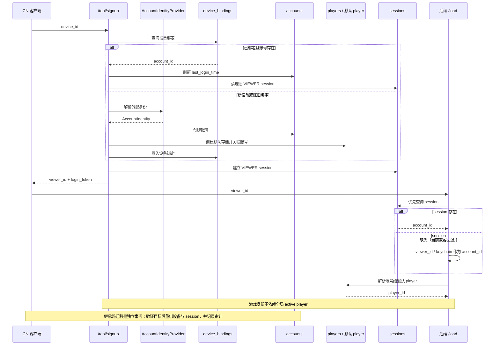
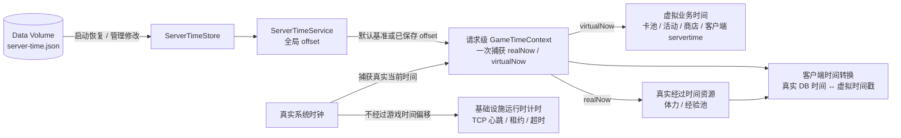
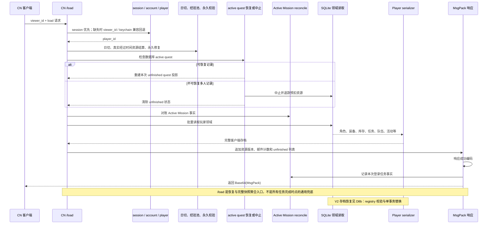
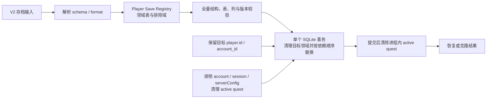

# 身份、时间与存档当前架构

本文描述设备注册、账号与 session、双时钟、CN `/load` 和 V2 存档恢复的当前边界。账号管理规则见[账号管理与继承](../systems/account-management-and-takeover.md)，存档格式和校验规则见[存档与输入校验](../systems/save-validation.md)。

## D6 当前账号、设备绑定与 session

设备注册的身份提供者只负责解析外部身份；账号、默认 player、设备绑定和 VIEWER session 仍由路由与领域层持有。当前 `/load` 保留 session 缺失时的兼容回退，这属于现状而不是推荐给新身份提供者的主路径。

| 事实 | 证据 |
|---|---|
| 已知设备复用账号，新设备创建账号和默认 player | `src/routes/cn/tool.ts` |
| 身份提供者与账号/session/player 存储解耦 | `src/lib/account-identity-provider.ts` |
| `/load` 使用 session 优先和 viewer/keychain 兼容回退 | `src/routes/cn/load.ts` |
| account 再解析账号级默认 player | `src/data/activeAccount.ts` |
| 继承事务重绑设备与 session 并记录审计 | `src/routes/cn/takeOver.ts` |

本图不把只写不读的 `viewerIdToAccountId` Map 表达为身份权威，也不展开继承密码、账号清理和后台管理界面。

## D7 当前全局服务器时间与双时钟

同一个业务操作应捕获一次 `GameTimeContext`，再按业务语义选择虚拟时间或真实经过时间。TCP 心跳、租约和超时属于基础设施计时，不受游戏时间偏移影响。

| 事实 | 证据 |
|---|---|
| `server-time.json` 保存全局 offset | `src/runtime/server-time/store.ts` |
| 默认服务器时间基准为 `2024-08-14T12:00:00Z` | `src/runtime/server-time/service.ts` |
| `GameTimeContext` 同时捕获真实与虚拟时间 | `src/runtime/time/game-time.ts` |
| 客户端时间转换使用同一个全局 offset | `src/utils.ts` |

本图不把 `players.time_offset` 连入运行时，也不把所有 `Date.now()` 自动解释为虚拟业务时间。

## D8 当前 CN `/load`

`/load` 是职责较宽的恢复与完整快照入口，但整体不是一个覆盖所有步骤的大事务。日切、校验、active quest 处理和任务对账各自使用已有的短事务或写入边界；登录任务事实只在 MsgPack 成功编码后提交。

| 事实 | 证据 |
|---|---|
| 身份解析、登录维护和永久校验 | `src/routes/cn/load.ts` |
| active quest 检查、恢复或中止退款 | `src/routes/cn/load.ts` |
| Active Mission 对账与完整玩家领域聚合 | `src/routes/cn/load.ts`、`src/data/utils/player-data.ts` |
| 登录事实使用响应 pending commit | `src/routes/cn/load.ts`、`src/routes/cn/msgpack.ts` |

本图不表示房间、TCP 或 BattleFact 可以跨进程重启恢复，也不把 `/load` 当作普通任务必须重启后才完成的设计时点。

## D8b 当前 V2 存档恢复

V2 存档只迁移声明在 registry 中的玩家业务领域。账号身份、session、服务器配置和进行中战斗不属于可迁移域；目标 `player.id` 与 `account_id` 保留。

| 事实 | 证据 |
|---|---|
| V2 schema、格式和排除域固定 | `src/data/player-save/types.ts` |
| Registry 声明领域表、依赖与 active quest 排除域 | `src/data/player-save/registry.ts` |
| 写入前完成结构、版本、表和列校验 | `src/data/player-save/v2.ts` |
| 单事务替换并在提交后清除进程内 active quest | `src/data/player-save/v2.ts` |

本图不展开旧 V1 部分恢复路径，也不把运行时 `/load` 响应当作 V2 备份文件。
