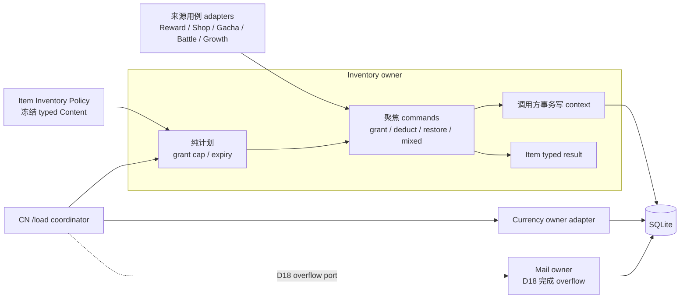

# D16 Item Inventory Owner 与 EventTrade 到期策略

状态：D16 设计/C1–C4、D18 C1–C5 生产实现和各 checkpoint 自动验证已完成，等待大 Gate A 综合审查与客户端验收。本文描述 Item owner、D18 cap/overflow 与 Mail disposition 的当前运行时合同；官方语义未知项仍按私服策略标注。

## 1. 背景

D15 已确认 Item 数量、持有上限、实际入库量、累计获得量与 Item 有效性属于 Inventory；奖励、商店、扭蛋、战斗、角色成长和邮件只是来源用例或协作者。D16 实施前，服务端虽然已有集中在 `data/domains/item.ts` 的 SQLite helper，但正常业务仍直接选择多种写法：

- 独立 grant 自建事务；
- 调用方事务内 grant/set；
- 已知存在行的裸 `UPDATE`；
- RewardGrant 内的请求级写缓存；
- admin、save restore 和玩家初始化的独立导入路径。

这些函数在数量、事务所有权、零行处理和 `players_collected_items.total_obtained` 上具有不同语义。仅把文件移动到同一目录不能形成 owner；D16 必须让正常业务只通过一个 Inventory contract 写 Item，同时保留 admin/save/bootstrap 的独立权限与完整性边界。

D16 还首次引入 Item 时间策略。当前 Content converter 已验证 `item.orderedmap` 的 23 列，却没有把 EventTrade effect 和 Item 时间窗保留到 Runtime Content，因此服务端无法按 CN Item 定义处理活动兑换道具到期。

## 2. CN Content 与客户端事实

### 2.1 Item Content

当前 CN Content 有 1284 个 Item，全部是 23 列记录。数字 Item ID 来自 orderedmap key；列 1 是 `display_order`，不是 Item ID。D16 使用的字段为：

| 来源 | 字段 | D16 语义 |
|---|---|---|
| key | Item ID | Inventory 身份 |
| 6 | `effect_kind` | `9` 表示 EventTrade |
| 14 | `category` | Item 分类；保留给现有出售与后续 typed reader |
| 16 | `sale_price` | 单个 Item 的 Mana 换算值 |
| 18 | `max_count` | 官方持有上限 |
| 19 | `start_time` | 可用开始时间 |
| 20 | `end_time` | 可选结束时间；`(None)` 表示无结束时间 |
| 21 | `sellable` | 玩家手动出售资格 |

时间文本使用 `YYYY-MM-DD HH:mm:ss`。CN 客户端保留了上游 `JST` 命名，但实际偏移为 UTC+8；服务端必须按 UTC+8 转为 epoch milliseconds，不能按 UTC+9 解释。

当前 CN Content 有 205 个 EventTrade：全部为 category 3 且 sale price 为正；其中 24 个没有结束时间，30 个 `sellable=false`。因此自动到期转换不能以手动可售为前置。

### 2.2 客户端可达性

CN 客户端能够证明：

- Item 可用性按 `start_time/end_time` 判断；
- 比较降低到秒精度；结束时间所在秒仍然有效；
- 过期 Item 不再进入可用 Item 列表；
- Item 容量判断是 `current + reward <= max_count`；
- Mail 响应可以区分 Item 过期出售结果。

静态客户端不能证明官服自动出售的服务端时点、数据库事务、Mana 上限处置、精确提示、记录删除方式或错误码。因此“EventTrade 在 `/load` 转换为 Mana”是已批准的私服策略，不得写成已确认官服内部实现。

## 3. D16 范围

### 3.1 Inventory 拥有

- 玩家 Item 数量的正常业务最终写入；
- grant、deduct、预付资源 restore、同请求 mixed settlement 与 absolute after-state 的不变量；
- 实际进入 Inventory 的数量和 `total_obtained`；
- Item cap 的纯 `accepted/overflow` 计划；
- Item Content 的最小 typed policy；
- EventTrade 到期 Item 后态计划；
- Item after-state 的 typed owner result。

### 3.2 独立协作者

- 来源用例拥有奖励、成本、次数、战斗、任务、商店或扭蛋事务；
- Currency owner adapter 拥有 Mana 和 `total_mana_obtained` 后态；
- Mail owner 拥有 overflow 邮件的创建、领取、过期和历史；
- HTTP adapter 拥有身份、MsgPack、错误映射与响应组合；
- Content Snapshot 提供冻结的 typed policy，不读取玩家状态。

### 3.3 明确不进入 D16

- 生产 Item grant 的 `max_count` 截断与 overflow Mail；
- 完整 Mail owner、`receive_all`、history 或邮件领取容量处理；
- 完整 RewardGrant、Shop、Gacha、Exchange、Mission 或 Battle 重构；
- Common Response 的跨资产 projector；
- 任意非 EventTrade Item 的自动出售；
- Mail 中过期 EventTrade 的领取转换；
- 新数据库 schema、pending conversion 表或通用 Economy/Command Bus。

## 4. 目标边界



Inventory 可以在调用方外层事务中提交 Item，但不能写 Currency 或 Mail。`/load` 的 EventTrade coordinator 只负责调用顺序和最外层事务，不成为第二个资产 owner。

## 5. Typed Item Content

D16 新增独立 `item_inventory_policy.json`，不改变现有 `item_data.json` 的“可使用 Item effect payload”语义。目标结构只保留真实消费者所需字段：

```ts
type ItemEffectKindCode =
    | 0 | 1 | 2 | 3 | 4 | 5 | 6 | 7 | 8 | 9
    | 10 | 11 | 12 | 13 | 14 | 15 | 16 | 17
    | 18 | 19 | 20 | 21 | 22

interface ItemInventoryPolicy {
    readonly effectKind: ItemEffectKindCode
    readonly category: number
    readonly salePrice: number
    readonly maxCount: number
    readonly sellable: boolean
    readonly startTimeMs: number
    readonly endTimeMs: number | null
}

interface ItemInventoryPolicyCatalog {
    readonly byItemId: Readonly<Record<string, ItemInventoryPolicy>>
    readonly eventTradeItemIds: readonly number[]
}
```

`eventTradeItemIds` 在 Content 转换期生成，用于一次批量查询玩家可能持有的 EventTrade；`/load` 不扫描 1284 条 policy、不重新解析 orderedmap，也不逐 Item 查询数据库。

转换器必须拒绝非 canonical ID、闭合集合 `0..22` 外的 effect kind、非法 safe integer、错误布尔值、错误 UTC+8 时间、倒置时间窗，以及 EventTrade 的非正 sale price。客户端已定义但当前 Content 未使用的 14、17 仍是合法 kind，不能按“当前出现值”收窄。`end_time=(None)` 转换为 `null`。Runtime Content 对象保持深冻结。

## 6. 纯计划与结果合同

### 6.1 Item cap 计划

纯 cap 计划接受：

```text
currentAmount + requestedAmount + maxCount
```

并返回：

```text
beforeAmount
afterAmount
acceptedAmount
overflowAmount
```

规则为：

- 不减少已经超过 `max_count` 的历史库存；
- 可用容量是 `max(0, maxCount - currentAmount)`；
- `acceptedAmount` 只表示实际进入 Inventory 的数量；
- `overflowAmount = requestedAmount - acceptedAmount`；
- 所有输入、乘法、加法和输出必须是非负 safe integer；
- 函数无数据库、事务、日志、Content 读取或响应职责。

D16 生产 grant 不调用 capped plan；D18 通过 `grantWithCapacity` 和 identity-bound overflow policy 激活生产 cap。普通来源在 Inventory flush 后写 overflow Mail，Mail 领取则使用 reject policy，避免原邮件再次包装成 overflow Mail。

D18 对 Item overflow 创建一封或多封确定性拆分的 Mail attachment；每封数量必须满足 `0 < number <= min(item.maxCount, 2147483647)`。所有拆分邮件与来源成本、accepted Item 和来源业务状态同一外层事务提交，任一创建失败全部回滚。Mail 领取仍保持整封原子，不引入单封部分领取状态。

Gate A 实机验收补充确认：Shop 在客户端发送购买请求前已经按 `current + purchase <= max_count` 限制购买数量，正常 Shop 购买不应产生 overflow；单人战斗的 score、首通、S+、additional 及战斗关联标准奖励则由服务端生成，不能依赖客户端购买前校验。`single finish` 已接入同一场结算的 identity-bound Item overflow policy，历史 over-cap 不倒扣，超出部分在原有战斗外层事务中写入 Mail。

### 6.2 Inventory Item result

每次 Item mutation 返回绝对后态，而不是把调用方绑定到 SQL helper：

```ts
interface InventoryItemResult {
    readonly itemId: number
    readonly beforeAmount: number
    readonly afterAmount: number
    readonly obtainedAmount: number
}
```

- grant 的 `obtainedAmount` 是实际进入 Inventory 的正数；
- deduct、到期出售和 absolute correction 的 `obtainedAmount` 为 0；
- endpoint 的 `item_list[itemId]` 使用 `afterAmount`；
- `total_obtained` 只增加 `obtainedAmount`，不得因重放、batch flush 或 response projection 重复增加。

### 6.3 五类 mutation 语义

正常业务不能用一个模糊的 `setItem` 代替所有写入：

| 语义 | 数量变化 | `total_obtained` | D18 cap/overflow |
|---|---|---:|---|
| `grant` | 来源奖励增加 Item | 增加实际进入 Inventory 的数量 | D16 preserve-all；D18 才激活 |
| `deduct` | 成本、使用或出售减少 Item | 不增加 | 不适用 |
| `restore` | 恢复已经预付的战斗入口资源 | 不增加 | 不应用 cap，不产生 overflow |
| `mixed` | 同一请求、同一 Item 同时扣除与奖励 | 只增加奖励部分 | 只对奖励部分规划；最终一次 absolute write |
| `maintenance/restore-import` | 后台精确设值、删除或整档恢复 | 不增加 | 不应用业务 policy |

战斗开始时的入口 Item 是 `deduct`；abort、失败结算或恢复时返还是 `restore`。返还不是新奖励，即使未来持有量已经接近上限，也不能被截断或转入 Mail。

同一 Item 的 batch 使用与调用顺序无关的规范化公式：

```text
baseAmount = beforeAmount - deductedAmount + restoredAmount

D16:
acceptedGrant = requestedGrant

D18:
acceptedGrant = min(requestedGrant, max(0, maxCount - baseAmount))

overflowGrant = requestedGrant - acceptedGrant
afterAmount = baseAmount + acceptedGrant
obtainedAmount = acceptedGrant
```

- deduct 的充足性只按请求开始前的 `beforeAmount` 验证，不能用同请求尚未获得的 grant 支付成本；
- restore 先进入 `baseAmount`，不应用 cap、不计 obtained；
- 只有 grant 应用 cap；D18 已激活，D16 preserve-all 的历史语义仍保留在未启用 policy 的内部路径；
- maintenance absolute set/delete 不得混入业务 batch；
- 多个 grant/deduct/restore 条目的排列不改变规范化结果；
- 每个受影响 Item 最终只执行一次 absolute write 和一次正向 obtained 记录。

## 7. Owner command 与事务

Inventory 只提供实际消费者需要的聚焦入口：

- standalone command：只允许在没有活动事务时调用，自己建立并拥有一个 SQLite transaction；若已有事务则立即拒绝，调用方必须显式选择 within/batch；
- within-transaction command：要求调用方已有活动事务，否则立即拒绝；
- caller-owned batch context：创建、读取、mutation 和 flush 均要求活动事务；同一 Item 的 grant/deduct/restore 在内存中按语义合并，flush 一次 absolute after-state，并单独累计正向 obtained；flush 后 context 失效，重复 flush 或继续 mutation 必须拒绝；
- deferred caller-owned batch：入口仍立即要求活动事务，但只在首笔真实 Item 访问时创建同一个 batch context；纯货币、纯装备、空计划和首次角色获得不读取 Inventory。callback 退出后，无论是否激活，context 都不能逃逸到后续事务；
- read/batch-read：一次读取明确 Item IDs，不建立跨请求玩家缓存。

RewardGrant 使用 deferred batch 覆盖 transaction-owner、within 和 standalone 三条执行路径。规范化 Plan 中静态可知的 direct Item ID 一次预加载；运行时重复角色补偿通过同一 callback-scoped port 惰性加入。三条入口在进入 Inventory 前都已经由各自事务契约确认玩家存在，因此 adapter 显式使用 `caller-verified`，不重复查询 Player；其他 Inventory 调用仍默认自行验证。每条响应在 mutation 当时记录绝对后态，最终每个 Item 只执行一次 absolute write 和一次累计获得写入。旧 `OwnerInventoryWriteCache` 已删除，RewardGrant 不再拥有第二份 Item 状态。

Inventory 不接受来源模块传入的普通 `Record` 作为可信库存快照。原 scheduled-resource 的 `knownItemsBefore` 在事务开始前读取，不能证明属于当前事务；W2 已删除该参数。scheduled-resource 仍以事务前批读判断来源阈值，真正发放时由 Inventory 在当前事务内再次批读 mutation 前态。这是避免旧快照 absolute write 的固定正确性成本，不是 N+1。

持久层继续是具体 SQLite repository，不为不存在的第二数据库定义通用 repository interface。Repository 负责：

- 新行与既有行写入；
- stable batch read；
- Item absolute after-state；
- `total_obtained` 的一次性记录；
- 活动事务断言和数据库错误传播。

Owner command 在写入前完成所有 safe-integer、非负数量与业务前态校验。网络发送不属于数据库事务；响应发送失败依靠来源用例已有幂等合同恢复，Inventory 不建立通用 receipt 表。

## 8. Writer 收敛边界

D16 基线中有 29 个生产模块直接导入 Item mutation primitive，另有后台裸 SQL 删除、registry 驱动的 V2 整档恢复和两处无引用旧 SQL。D16 将正常业务对 `givePlayerItem*`、`setPlayerItem*`、`updatePlayerItem*` 和 collected-item helper 的调用迁移到 Inventory contract。迁移只替换 Item writer，不改变来源用例的费用、奖励、次数、错误、Mission publication 或最外层事务。

按职责分类：

| 类别 | D16 处置 |
|---|---|
| RewardGrant 与正向奖励 | 使用 Inventory batch context；D17 再收敛 RewardGrant 协调器 |
| Shop/Gacha/Exchange | 只替换 Item 成本或奖励 adapter；领域生命周期保持独立 |
| Single/Multi/Event settlement | 保留各自外层事务，只替换 Item command |
| Character Growth/Equipment/Item use/sell | 保留现有规划与 rollback，只替换最终 Item write |
| Battle entry/abort/failure | 入场使用 deduct；返还使用独立 restore，保持幂等且不增加累计量 |
| Mission/periodic/login 等奖励 | 使用 standalone 或 caller-owned command，保持现有原子边界 |
| Admin、save restore、bootstrap | 保留独立权限与完整性 adapter；不得伪装成 CN 正常业务入口 |

Gate 退出时，正常业务不能再直接导入低层 Item writer；repository primitive、admin/save/bootstrap 的明确白名单和只读查询不算第二个业务 owner。不得保留长期双写或只转发旧函数名的迁移 facade。

## 9. EventTrade 到期转换

### 9.1 纯 expiry plan

候选必须同时满足：

```text
owned amount > 0
effectKind == 9
endTimeMs != null
floor(nowMs / 1000) > floor(endTimeMs / 1000)
```

`sellable=false` 不排除自动转换。计划按 Item ID 固定排序，计算每项 `amount * salePrice` 和总 Mana；非法、重复或 unsafe 输入 fail closed。计划不修改输入，不写 DB，不生成 Mail，也不增加 Item `total_obtained`。

### 9.2 `max_mana` 分配

Inventory expiry plan 只输出 Item entries 与 `totalMana`，不读取 Currency 状态或配置。`/load` coordinator 把 `totalMana` 交给窄 Currency capacity adapter，由后者读取当前 free/paid Mana 与 Content `max_mana` 并返回：

```text
currentTotalMana = currentFreeMana + currentPaidMana
capacityMana = max(0, maxMana - currentTotalMana)
acceptedMana = min(totalMana, capacityMana)
overflowMana = totalMana - acceptedMana
```

所有 Currency 输入、求和和结果必须是非负 safe integer；历史状态已经超过 `max_mana` 时容量为 0。D18 把 `acceptedMana` 立即计入余额，只把 `overflowMana` 进入拆分后的 Mail。

最终私服策略是：Item 清零、`acceptedMana` 加入玩家余额、`overflowMana` 在同一事务内进入一封或多封确定性拆分的 31 天 `FREE_MANA` 邮件。每封附件必须满足 `0 < number <= min(maxMana, 2147483647)`，使玩家把总 Mana 消耗到足够低时每封都存在合法领取状态；不把一封邮件改成可部分领取。任一邮件创建失败时，Item、余额、累计量和全部邮件都回滚。

转换事务只把立即进入余额的 `acceptedMana` 计入 `total_mana_obtained`；创建邮件不计入，未领取或过期也不计入。以后每封 overflow Mail 真正领取并进入余额时，再由 Currency owner 按该封成功领取数量恰好增加一次。Inventory 不计算 Currency 容量，Currency adapter 也不能修改 Item。

D18 已建立 Mail 领取的 `max_mana` exact claim：FREE_MANA 与过期 EventTrade sale Mana 在领取前按 `free_mana + paid_mana` 预检，容量不足时邮件保持未领取。`/load` 的 EventTrade overflow 则在同一事务内清 Item、入账 accepted Mana 并创建 overflow Mail。

该分阶段合同避免丢值、越界、账号登录锁死、临时 Mail facade 和尚未定义的部分 Item 出售顺序。

### 9.3 `/load` 事务位置

EventTrade settlement 在登录奖励和 scheduled resource 之后、最终玩家完整序列化之前执行，使用虚拟业务时间。成功后 `/load` 重新读取玩家后态；同一响应的 `item_list`、`user_info.free_mana`、`mail_arrived` 和任务事实只能观察提交后的状态。

成功转换把目标 Item amount 置 0。第二次 `/load` 因持有量为 0 自然 no-op，不新增结算 receipt 或 schema。D16 Currency adapter 按 `acceptedMana`（此时等于 `totalMana`）增加 `total_mana_obtained`；D18 也只增加当次立即入账的 `acceptedMana`，使后续 Mission/Awake reconciliation 只观察真实入账状态。

## 10. Admin、Save 与损坏状态

Admin CRUD、v2 save restore 和玩家初始化不是 CN 客户端正常入口，继续拥有独立权限、整包事务与损坏存档校验。D16 不把这些入口合并到 HTTP Inventory command，也不因“客户端不可达”删除其测试。

正常业务 writer guard 必须明确列出允许的 repository/import adapter；maintenance set/delete 和 save/bootstrap import 使用显式命名的独立 adapter，不伪装成 grant。未知 Item、非法 Content、unsafe amount 或损坏 Currency 状态不能被自动猜测修复。EventTrade settlement 对未知 Item 不做转换，避免把 admin/save 异常状态静默变成 Mana。

## 11. 性能合同

D16 的结构准入为：

- Runtime Content 初始化后不再读取或解析 Item orderedmap；
- Item policy lookup 为 O(1)，EventTrade 候选 ID 来自冻结索引；
- `/load` 对候选库存最多一次批量读取；
- 无到期 Item 时零写入、零额外事务；
- N 个到期 Item 不产生 N 次玩家回读或 N 次 Currency update；
- batch context 对同一 Item 只 flush 一次；
- 同一 Item 的重复来源条目不产生重复 SQL；distinct Item 写入只按受影响行线性增长；
- 正式性能门禁继续使用同机基线，p95 不得退化超过既有阈值。

性能优化不能改变事务顺序、错误边界、Item after-state 或累计获得量，也不能引入跨请求玩家库存缓存。

## 12. 测试可达性与完成条件

D16 测试只覆盖真实客户端入口、owner/事务不变量和真实旁路，不构造客户端无法提交的 route 参数笛卡尔积。

最低证据包括：

- converter：23 列、UTC+8、结束秒、EventTrade 9、无 end、倒置/非法 Content；effect 14/17 合法，负数/23/非整数非法；
- pure cap：accepted/overflow、历史 over-cap 不倒扣、safe integer；
- pure expiry：未到期、结束秒、EventTrade/non-EventTrade、`sellable=false`、批量与稳定顺序；
- owner：新/旧 Item、grant/deduct、规范化 mixed、batch coalescing、`total_obtained` 与 fault rollback；
- transaction：standalone commit/rollback 与已有事务拒绝、within 无事务拒绝、batch 全生命周期事务要求、单次 flush/重复使用拒绝、来源外层事务整体 rollback；
- restore：战斗预付资源返还恢复数量，但不增加 `total_obtained`、不应用 cap；
- maintenance/save：后台 set/delete 与 V2 双表 round-trip 不应用业务 policy；
- writer migration：代表来源保持原 endpoint after-state 和现有最外层事务；
- `/load`：首次转换、重复 no-op、paid+free 总容量、Mana overflow Mail、非 EventTrade 不处理、事务故障回滚和最终完整投影；
- D18 admission：Mana overflow 大于 `max_mana`、Item overflow 大于 `max_count`、确定性多封拆分、中途故障全回滚、逐封领取、`receive_all` 跳过当前装不下邮件并继续其他邮件、累计量分次且恰好一次；
- performance：N=0、N=1、批量 Item 的 SQL/事务/Content lookup admission；
- admin/save/bootstrap：独立 adapter 和 round-trip 不回归；
- 一次 broad closure 与独立 whole-branch review。

既有测试是迁移安全网，但不能单独证明行为未变；完成还要求零正常业务 writer bypass、Content/客户端可达性证据、fault rollback、性能准入和合法 `/load` 入口验证。

事务拓扑至少保留五个代表：无外层事务的 standalone、来源用例外层事务、RewardGrant batch、Battle restore、maintenance/save。静态 writer guard 只能证明没有 import bypass，不能替代这些事务行为测试。

## 13. 实施状态

```text
D16_BASE: b6fd6bbf182a51e2ba2556840873d054b6b1149f
D16_DESIGN_STATUS: APPROVED
D16_IMPLEMENTATION_STATUS: COMPLETE (C1-C4 landed; checkpoint validated)
D18_IMPLEMENTATION_STATUS: COMPLETE (C1-C5 landed; checkpoint validated)
ITEM_CAP_PRODUCTION_STATUS: ACTIVE (explicit grant-only policy)
EVENT_TRADE_OVERFLOW_MAIL_STATUS: ACTIVE (private-server strategy)
```

D16 设计、正常 writer 清单、C1-C4 生产实现、D18 C1-C5、focused groups 和结构性能准入已经完成；大 Gate A 的唯一 broad、整体终审、服务重启和客户端验收仍待 D18 后执行。D18 的 cap/overflow 与 Mail 领取是已落地私服策略，不等同于已证明的官服后端实现。
