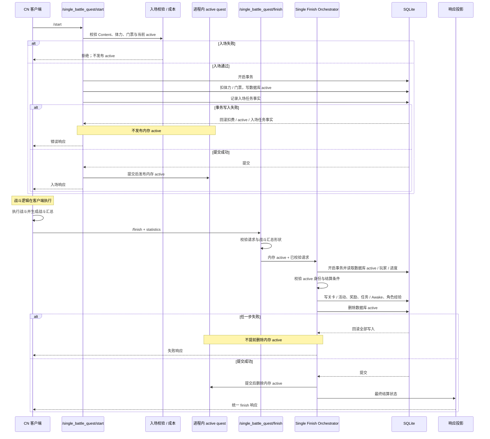

# StarPoint CN 任务与单人战斗

本页展示当前 Category Mission 结算主链，以及普通单人战斗从入场到结算的事务生命周期。

## 单人复活当前边界

`/single_battle_quest/play_continue` 的 CN 1.8.1 请求复活次数来自
`sum(statistics.zones[].continue_count)`；`statistics.continue_count` 不是 CN 1.8.1 顶层字段，服务端不接受它作为
兼容来源。费用权威是共享配置 `getConfigSync().continue_virtual_money`，扣款先消耗 `free_vmoney`，不足部分从
`vmoney` 扣除。成功响应是 HTTP 200、Base64(MsgPack)、`data_headers.result_code=1`，并返回扣款后的
`user_info` 余额。官方负路径非成功 `result_code` 仍未知/延期；`battle_max_continue_count` 的服务端权威校验
同样延期。玛纳板与角色觉醒独立性不因本边界而改变，属于后续独立 Gate。

## D2 当前任务结算流水线

```mermaid
flowchart LR
    INPUT["入口 / 业务事实<br/>Active Mission：独立引擎旁路"]
    SNAPSHOT["冻结的 Content Snapshot"]
    CATALOG["MissionCatalog 候选<br/>Awake：仅候选 / 解锁分支"]

    subgraph TX["外层 SQLite 事务"]
        PREPARE["prepare<br/>固定范围、时间与候选"]
        SESSION["MissionEvaluationSession<br/>按 FactKey 计划、装载与复用"]
        COMPUTE["Fact Loader + Computer<br/>同步读取 + 纯计算"]
        RESULT["EvaluationResult<br/>evaluate 不写库"]
        WRITE["settle / write<br/>写进度与 stage"]
        GRANT["RewardGrant<br/>阶段 A 发奖并产出失效 FactKey"]
        STAGE_B["阶段 B<br/>只重算受影响的响应进度<br/>不再次写进度或发奖"]
    end

    INPUT -->|"Category Mission"| CATALOG
    SNAPSHOT -->|"仅提供 Catalog 定义"| CATALOG
    CATALOG -->|"已启用候选"| PREPARE
    PREPARE --> SESSION
    SESSION -->|"按需取事实"| COMPUTE
    COMPUTE --> RESULT
    RESULT --> WRITE
    WRITE --> GRANT
    GRANT -->|"invalidated FactKey"| STAGE_B
```

### 边界说明

- Category Mission 在外层 SQLite 事务中执行 `prepare -> evaluate -> settle`；`evaluate` 只产出结果，不写领域状态。
- MissionCatalog 只从当前 Content Snapshot 构建候选，Session 按 FactKey 计划、加载并复用事实。
- 阶段 A 写进度并发奖；阶段 B 只重算受奖励影响的响应进度，不再次写进度或发奖。
- Active Mission 使用独立的计划、事实会话与调和写入链，本图只标示旁路关系。

### 精简证据

| 图中事实 | 仓库相对证据路径 |
|---|---|
| 候选选择及 `prepare/evaluate/settle` 位于外层事务 | `src/lib/mission/settlement.ts`、`src/lib/mission/settlement-prepare.ts` |
| Catalog 从当前 Content Snapshot 构建并筛选候选 | `src/lib/mission/mission-catalog.ts` |
| Session 汇总 FactKey、生成加载计划并缓存事实 | `src/lib/mission/evaluation-session.ts` |
| evaluate 读取事实并纯计算最终进度 | `src/lib/mission/settlement-evaluate.ts` |
| settle 写进度和 stage，RewardGrant 返回失效 FactKey | `src/lib/mission/settlement-write.ts`、`src/lib/mission/grants.ts` |
| 阶段 B 只覆盖响应中的受影响进度 | `src/lib/mission/progress-stage-b.ts`、`src/routes/api/mission.ts` |

### 本图不表达

- 不展开 Active Mission 的事实种类、领奖接口和调和算法。
- 不展开 Awake 的资格批量读取、缓存或具体任务定义。
- 不表达未来任务引擎合并、异步化或分布式方案。

## D3 当前单人战斗生命周期

### 边界说明

- `/start` 与 `/finish` 是两个独立事务；实际战斗由客户端执行，服务端接收入场请求和战斗汇总。
- 入场扣费、数据库 active 和入场任务事实同成同败；内存 active 只在提交后发布。
- finish 在同一事务校验 active 并写关卡、奖励、任务、Awake 与角色经验；数据库 active 在写入链末端删除。
- finish 失败时保留内存 active；成功提交后才删除内存镜像并生成统一响应。

### 精简证据

| 图中事实 | 仓库相对证据路径 |
|---|---|
| `/start` 校验 Content、入场成本和 active | `src/routes/api/singleBattleQuest.ts`、`src/lib/quest/start-entry.ts` |
| 入场扣费、数据库 active 和任务事实共享事务 | `src/lib/quest/start-entry.ts`、`src/routes/api/singleBattleQuest.ts` |
| 内存 active 在入场事务成功后发布 | `src/lib/quest/active-quest-service.ts` |
| `/finish` 校验请求与战斗汇总 | `src/lib/quest/single-finish-validation.ts` |
| finish 事务统一校验并写入结算状态 | `src/lib/quest/single-finish-settlement.ts`、`src/lib/quest/finish/single-settlement-writes.ts` |
| 提交后删除内存 active 并投影协议响应 | `src/lib/quest/finish/single-orchestrator.ts`、`src/lib/quest/finish/single-response-projector.ts` |

### 本图不表达

- 不展开活动关卡、掉落、首通和分数奖励算法。
- 不表达服务端战斗模拟、伤害权威判定或客户端帧级过程。
- 不展开 `/abort`、`play_continue`、自动周回和多人战斗分支。
