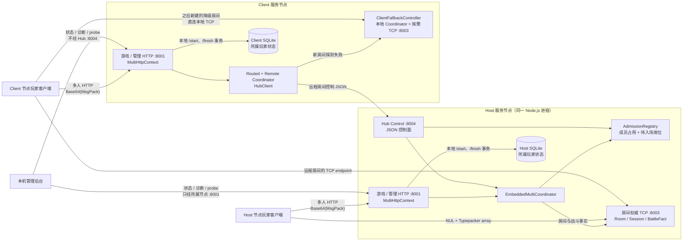
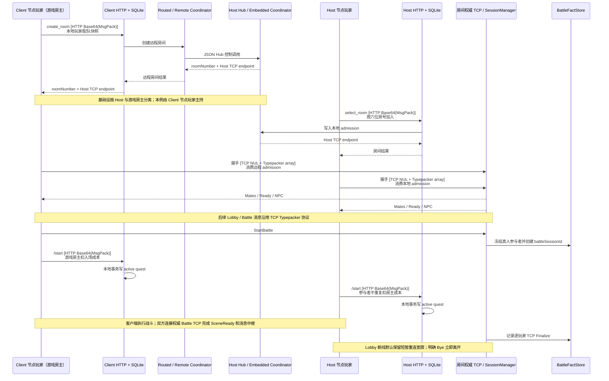
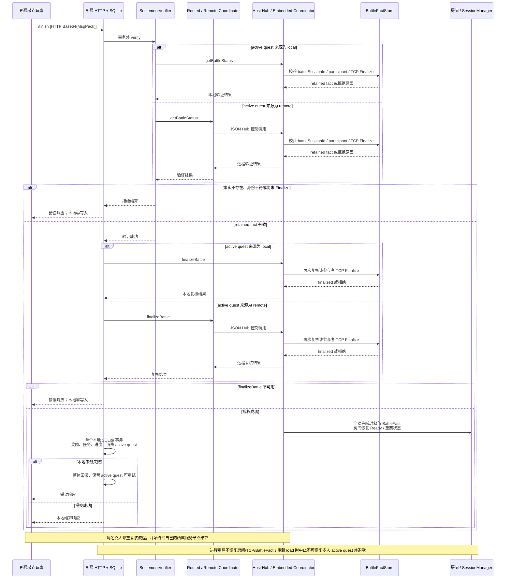

# 多人联机与 Hub 当前架构

本文只描述当前 `embedded`、`host` 和 `client` 实现，不表达未来公网联邦、横向扩展或跨进程房间恢复。协议字段见[多人联机协议](../protocol/multi-battle.md)，部署与故障边界见[可信多人 Hub](../protocol/trusted-multi-hub.md)。

## D10 当前多人联机与 Hub 拓扑

Host 的 HTTP 8001、多人 TCP 8003 和 Hub Control 8004 是同一个 Node.js 服务进程中的不同监听边界。基础设施 Host 不等于游戏房主；Client 节点玩家也可以在 Host 权威房间中主持战斗。每个节点只读写自己的 SQLite，Hub 不复制玩家存档，也不代理主游戏 API、CDN 或后台。

Client 的本地降级只选择之后新建房间的 Coordinator 和 TCP；已经存在的远程房间及其 active quest 不随探测结果迁移。管理状态、诊断与 probe 始终通过所属节点 8001，不通过 Hub Control 8004。

| 事实 | 证据 |
|---|---|
| Host 装配 Embedded Coordinator、TCP 和 Hub Control | `src/multi/runtime/service.ts` |
| Client 使用 Routed/Remote Coordinator，失败时按需启动本地路径 | `src/multi/runtime/service.ts`、`src/multi/runtime/client-fallback.ts` |
| 房间响应下发实际 TCP endpoint | `src/multi/room/serializer.ts` |
| 两个节点各自持有玩家快照、active quest 和结算 | `src/multi/player-context.ts`、`src/multi/http/battle.ts` |
| 管理接口只注册在本机游戏 HTTP | `src/routes/web_api/index.ts` |

本图不表达公开房间列表、真人随机匹配、跨 Hub 房间发现、TLS/NAT 穿透、外置 Coordinator 或消息队列。

## D11a 当前多人建房与开战时序

当前没有公开大厅；房间发现只表达六位房号或 access token。所属服务生成最小玩家与配队快照，Host 通过权威 `AdmissionRegistry` 预留真人席位并约束一次性 TCP 握手。房间最多 3 名真人，待入场 admission 与已登记成员共同计数；失败、过期、节点撤销和房间解散都会释放预留。双方分别向自己的服务调用 `/start`，只有游戏房主所属节点扣除房主入场成本。

| 事实 | 证据 |
|---|---|
| 房间创建、房号选择和 admission | `src/multi/http/lobby.ts`、`src/multi/http/room-admission.ts`、`src/multi/admission/registry.ts` |
| TCP 握手消费 admission 并建立复合身份 | `src/multi/tcp/handshake.ts` |
| StartBattle 冻结参与者并创建 battle session | `src/multi/tcp/lobby.ts`、`src/multi/settlement/facts.ts` |
| Battle TCP 负责 SceneReady、中继和 Finalize | `src/multi/tcp/battle.ts` |

本图不表达 `/finish` 结算授权、公开房间列表、真人随机匹配，也不展开全部 NPC 和双场景消息。

## D11b 当前所属节点结算授权

`SettlementVerifier` 和 `finalizeBattle` 都发生在本地 SQLite 写事务之前。验证或复核失败时所属节点零写入；本地事务失败时奖励、任务、进度和 active quest 消费整体回滚。Hub 只保存和验证房间/战斗事实，不发放玩家奖励。

| 事实 | 证据 |
|---|---|
| active quest 保存 local/remote Coordinator 来源 | `src/multi/coordinator/router.ts`、`src/lib/quest/active-quest-service.ts` |
| `/finish` 先验证和复核，再进入本地 SQLite 事务 | `src/multi/settlement/orchestrator.ts` |
| 全员完成时释放事实并恢复房间 | `src/multi/coordinator/embedded.ts` |

本图不表示房间、TCP 或 BattleFact 能跨进程重启恢复，也不展开全部 TCP 枚举、NPC 行为和双场景消息。
