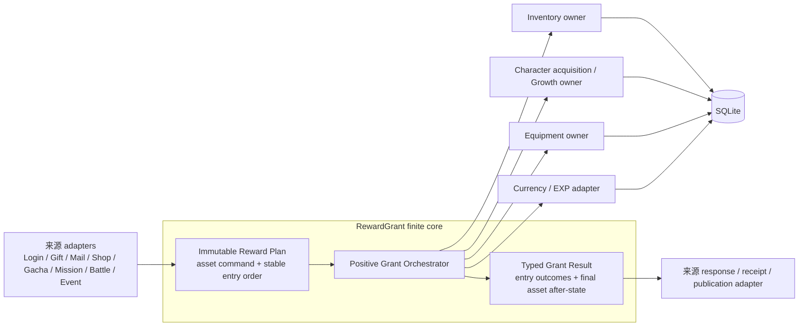

# D17 RewardGrant 正向协调核与 Typed Grant Result

状态：B0 设计已经通过独立审查，可以进入 D17 生产实现。C1-C5 未完成前，当前运行时仍以 `docs/systems/reward-grant-transactions.md` 和现有代码为事实。

## 1. 背景

D16 已把正常业务 Item 写入迁移到唯一 Inventory owner，并让 RewardGrant 的 Item 分支复用同一 caller-owned batch。当前 RewardGrant 已有 immutable plan、standalone/within/transaction-owner 三类入口和请求内 Item 合并，但结果仍以客户端形状 `PlayerRewardResult` 为主体：

- `aggregate.user_info` 表示本次奖励增量，不是玩家绝对后态；
- `aggregate.items` 表示 Item 绝对后态；
- Character/Equipment 是客户端对象数组；
- `playerAfter` 只有三种玩家资源绝对值；
- Gacha、Score Reward 和 legacy Quest 为取得逐 entry 补偿 Item 增量而直接依赖私有 `InternalRewardGrantResult.itemDeltas`；
- consumer whitelist 和多处源码形状断言承担迁移期边界，新增合法 adapter 时需要同步修改。

D17 不重写各来源业务，而是把 RewardGrant 收敛为有限的正向协调核：计划只保留正向资产命令和稳定顺序，执行委托各资产 owner，结果明确区分请求量、实际正向获得量、执行期 after-state 和最终聚合 after-state。来源 adapter 通过同长度、同顺序的本地 metadata 与 entry outcome 关联，继续拥有客户端响应、receipt、progress、payment 和 publication。

B0 还确认了三处必须由 D17 关闭的边界缺口：source-owned Inventory context 目前由 RewardGrant `flush()` 并关闭；Mission 的 `degreeId` patch 被并入 RewardGrant Currency SQL；Active Mission 使用事务外 Player 快照创建 granter，不能证明 transaction-owner 的 known state 来自当前事务。

## 2. 三层证据

### 2.1 Content

CN Content 中 Mission、Quest、Event、Login、Shop 和 Gacha 都存在真实奖励记录；共同字段可归一为奖励类型、资源 ID 和数量。不同来源的 mission/stage、quest/group、event/tier、shop product、banner/prize 等 source key 仍不同。Content 证明可以共享正向 Reward plan，不证明共同持久状态、事务、错误码或 overflow 生命周期。

### 2.2 客户端

CN 客户端通过不同 Remote 和页面进入 Login、Mail、Mission、Shop、Gacha、Quest/Event 等来源流程；响应中重复出现 `user_info`、`item_list`、`character_list` 和 `equipment_list`，但各来源的合并时点、附加字段和生命周期不同。共同响应字段支持 typed owner result 与字段级 adapter，不支持把来源 endpoint 合并为一个 Reward route，也不支持 whole-aggregate replace。

### 2.3 服务端

当前服务端已经有以下共同事实：

- `RewardGrantPlan<TSource>` 当前捕获 reward 并冻结 entry 外壳，但任意 `source` 仍是可变引用；
- standalone 自有事务，within 要求外层事务并使用计划级 savepoint，transaction-owner 不建立额外事务；
- Item 使用 D16 Inventory batch；Character、Equipment 和 Currency/EXP 使用各自当前写入边界；
- 同一计划任一执行失败必须回滚本计划或来源外层事务；
- Gacha、Box 和 Score 需要逐 entry 对齐，而最终资产结果需要按资产 ID 聚合；其他多数 source metadata 没有运行时消费者。

当前分歧集中在 result shape 和 internal API，而不是需要另建跨资产持久化 aggregate。

## 3. D17 范围

### 3.1 RewardGrant 拥有

- immutable 正向 Reward plan 与输入校验；
- plan entry 顺序和稳定数字 index；
- 支持奖励类型的分派；
- 调用各资产 owner/adapter 的执行编排；
- 同一计划内 Item 的共享 Inventory batch；
- typed per-entry outcome；
- typed final asset results；
- standalone、within 和 transaction-owner 的执行合同；
- 执行失败的统一领域错误包装；
- RewardGrant 自身的依赖方向、性能和公共 API。

RewardGrant 不拥有来源 metadata。Gacha draw、Score group/index、Box kind、Mail ID、Mission ID 等保留在来源 adapter；RewardGrant 只保证结果与计划 entry 一一对应且顺序不变。

### 3.2 来源用例继续拥有

- Login 的业务日、组选择和领取进度；
- Gift 的 code、资格和 redemption receipt；
- Mail 的邮件资格、领取、过期、history 和通知；
- Shop 的产品、成本、库存/次数和购买事务；
- Gacha 的 payment、seed、draw、history、point 和域内 exchange；
- Mission 的 candidate、facts、progress、stage、receipt 和特殊奖励；
- Battle/Event 的 active identity、结算、进度和模式状态；
- endpoint 的 MsgPack、错误映射和响应字段。

### 3.3 资产 owner 继续拥有

- Inventory：Item 数量、`total_obtained`、grant/deduct/restore 和 D18 cap 结果；
- Character acquisition/Growth：首次拥有、重复 stack 和补偿规则；
- Equipment：装备拥有量与最终状态；
- Currency/Player adapter：免费 Mana、免费星导石和 EXP pool 的最终状态与累计量；
- Mail：D18 overflow disposition 和邮件生命周期。

### 3.4 明确不进入 D17

- 任何扣费、deduct、refund、Battle restore 或撤销；
- Item cap/overflow 的生产激活和 Mail 创建；
- Mail single/receive_all 生命周期；
- Shop、Gacha、Star Crumb 或 Bond Token Exchange owner；
- Mission 或 Battle owner 收口；
- 完整跨资产 `AcquisitionOutcome` 与 `over_max`；
- 通用 Common Response projector；
- 万能 Economy/Reward/Command Bus；
- 未知官服错误码和客户端不可达组合的 E2E 矩阵。

## 4. 目标边界



RewardGrant 不写一个自己的 aggregate 表，也不成为来源事务 owner。它拥有协调与结果合同，不拥有资产和来源生命周期。

## 5. Reward plan

目标 `RewardGrantPlan` 满足：

- 只允许当前已经支持的正向奖励类型；
- ID 和 count 是正 safe integer；
- Character 没有伪造 count；
- 捕获 reward 快照并冻结 entries；
- 不读取数据库或 Content；
- 规范化前完成事务准入，非法 plan 不产生写入。

Plan normalization 不把相同 Item 的多条 entry 合成一条。多条 entry 可能分别对应不同 draw、score slot、mail 或 mission reward，必须保留原顺序和逐 entry outcome。相同 Item 的批读与最终写入由 Inventory batch 合并，而不是破坏 plan 结构。

来源 identity 不再作为任意泛型对象穿过 RewardGrant。Gacha、Box 和 Score 等需要关联的 adapter 在本地保存与 plan 同长度的 typed metadata，并按 entry index 消费 outcome；长度或 reward identity 不一致时在任何来源写入前 fail closed。这样保留逐 entry 归属，又不让可变来源对象成为 RewardGrant 的公共合同。

## 6. Typed Grant Result

### 6.1 设计原则

Typed result 必须区分：

1. 输入请求的 reward；
2. 该 entry 实际产生的正向资产变化；
3. 该 entry 执行后的资产 after-state；
4. 整个 plan 执行结束后的 distinct asset after-state；
5. 来源业务自己的响应和 receipt。

前四项属于 RewardGrant；第五项不属于。

### 6.2 目标模型

最终字段名由 C1 类型实现验证，但语义冻结为：

```ts
interface RewardGrantResult {
    readonly entries: readonly RewardGrantEntryResult[]
    readonly assets: RewardGrantAssetResult
    readonly playerAfter: RewardGrantKnownPlayerState
}

interface RewardGrantEntryResult {
    readonly index: number
    readonly reward: RewardGrantReward
    readonly outcome: RewardGrantEntryOutcome
}

interface RewardGrantKnownPlayerState {
    readonly playerId: number
    readonly freeMana: number
    readonly freeVmoney: number
    readonly expPool: number
}

interface RewardGrantItemOutcome {
    readonly itemId: number
    readonly requestedAmount: number
    readonly acceptedAmount: number
    readonly overflowAmount: number
    readonly beforeAmount: number
    readonly afterAmount: number
}
```

`RewardGrantEntryOutcome` 是按 reward kind 的判别联合：

- Item/Element/Aether：复用 `RewardGrantItemOutcome`；
- Character：Character ID、是否首次获得、当前角色 after-state，以及本 entry 产生的零或一个 `RewardGrantItemOutcome` 补偿；
- Equipment：Equipment ID、请求量和装备 after-state；
- Mana/Beads/EXP：资源 kind、本 entry 正向获得量及执行前后绝对值。

`assets` 按 distinct asset identity 提供整个 plan 的最终 after-state，不使用客户端 `user_info`、`character_list`、`equipment_list` 或字符串键 `items` 作为领域本体。各资产使用冻结的 readonly record array，不暴露运行时可变的 Map/Set。数组按该资产第一次出现在 entry outcome 中的顺序排列；重复资产用最后 after-state 替换该位置内容，不改变位置。Character compensation Item 的首次位置按产生补偿的 Character entry 计算。

Character/Equipment 当前 owner 尚返回客户端兼容对象时，D17 可在窄 adapter 中暂存 opaque snapshot，但必须同时携带稳定的 kind 和 ID，并对实际存在的普通对象和数组做 owned recursive copy/freeze；不能复用 owner 返回的可变嵌套引用。D17 不借此重开 D23 或 D28。

### 6.3 Item 语义

D17 生产 grant 仍是 preserve-all，所有直接 Item 和重复 Character 补偿的 `RewardGrantItemOutcome` 固定满足：

```text
acceptedAmount == requestedAmount
overflowAmount == 0
afterAmount == beforeAmount + acceptedAmount
```

这里的 `beforeAmount` 是紧邻该 entry 正向 grant 前的数量，可能已经包含来源先执行的 cost/deduct/restore 和更早 entry 的 grant；它不是整个来源事务最初的库存。D18 只改变 Item grant allocation，使 `accepted + overflow = requested`，不改变 entry identity 或让来源重算 Character 补偿规则。

同 Item 多 entry 的执行期 after-state按 plan 顺序单调推进；`assets.items` 只保留 plan 最终 absolute after-state。`total_obtained` 由 Inventory owner 按整批实际获得量恰好增加一次，不由 RewardGrant 重新计算或写入。

### 6.4 Character 补偿

首次 Character 获得不激活 Inventory。重复 Character 由 Character Growth owner 增加 stack；Character owner 决定补偿 Item ID 和请求数量，RewardGrant 不复制 rarity/element 补偿公式。补偿必须复用同一 RewardGrant Inventory context，并返回完整 `RewardGrantItemOutcome`，替代私有 `itemDeltas`；最终 Item 仍进入 `assets.items`。

D17 preserve-all 的 contract test 同时覆盖直接 Item 与 Character 补偿的 `requested=accepted`、`overflow=0`。D18 再用 cap-1、cap-full 和历史 over-cap 的真实 Inventory allocation验证非零 overflow、Mail disposition 和只按 accepted 增加 `total_obtained`；D17 不提前激活 cap。

### 6.5 Currency

Mana、免费星导石和 EXP pool 在同一 plan 内使用一个事务内 Player after-state accumulator，最终最多执行一次 Player update。每 entry outcome 可以表达本 entry 的 before/after；`playerAfter` 表达计划最终绝对值。Mana 的 `total_mana_obtained` 只按实际 Mana grant 增加。

### 6.6 不可变性

Plan、entry、outcome、asset collections 和 `playerAfter` 都必须创建 owned snapshot 并深冻结。Contract test 必须尝试修改 entries、outcome、final asset array、Character 嵌套 `bond_token_list` 和 `playerAfter`，并证明结果及后续投影不变。RewardGrant 不能通过结果泄露来源 metadata、可变临时 cache 或事务 context。

## 7. 执行入口与事务

### 7.1 Standalone

- 只允许调用方没有活动事务；
- normalization 在事务前完成；
- RewardGrant 建立一个事务，读取并验证 Player；
- 任一资产失败时全部回滚；
- 成功后返回 typed result。

### 7.2 Within transaction

- 没有活动事务时立即拒绝；
- normalization 后建立一个计划级 SQLite savepoint；
- 计划失败只回滚本 RewardGrant 计划，调用方可以决定是否继续外层事务；
- 不允许某个资产 executor 自行提前提交。

### 7.3 Transaction owner

- 调用方拥有活动事务和来源生命周期；
- 调用方必须提供在当前事务内读取、与 `playerId` 对应的 `RewardGrantKnownPlayerState`；RewardGrant 验证 `known.playerId === playerId`；
- 该状态是进入正向 grant 时的前态，必须包含来源在 grant 前已经授权并执行的资源变化；Shop 因此传入扣费后的派生状态，而不是原始数据库快照；
- RewardGrant 不建立 savepoint、不读取 Player 来替代调用方证据；
- external Inventory context 只用于来源成本和奖励必须共享同一 Item snapshot 的 Shop/Gacha/Box 等路径；
- result 不能在事务提交前被当作已对客户端可见的状态。

同一事务内一个 RewardGrant 的 `playerAfter` 可以直接成为下一个 plan 的 known state，因为它保留 `playerId`。错误玩家的合法数字快照也必须在任何 RewardGrant 写入前拒绝。Active Mission 不得使用事务外旧快照覆盖事务内状态。

### 7.4 空计划

空 plan 是合法 no-op。它仍返回与已知 Player 前态一致的空 typed result，但不得激活 Inventory、Character、Equipment 或 Currency executor，不得写 Player。Standalone/within 必须保持“缺失 Player 仍拒绝”的现有行为，因此允许一次 Player existence/after-state 读取；当前两次读取应收敛为最多一次。Within 继续保留一个计划级 savepoint，transaction-owner 不增加事务。

## 8. Executor 边界

| Executor | 允许 | 禁止 |
|---|---|---|
| Item | 调用 D16 Inventory grant/batch，返回实际获得量和 absolute after-state | 直接 SQL、deduct/restore、cap、Mail |
| Character | 调用 Character acquisition/Growth duplicate command；补偿 Item 走同一 Inventory context | Mana Board/Awake/EXP 等完整 Growth 生命周期 |
| Equipment | 调用 Equipment acquisition，返回 ID 与 after-state | 强化、分解、保护、Exchange 生命周期 |
| Currency/EXP | 在事务内累计免费 Mana、免费星导石、EXP pool，最终一次持久化 | 扣费、free-first、退款、overflow Mail |

Executor 只能依赖比 RewardGrant 更底层的资产 owner/adapter。Mission、Quest、Shop、Mail、Gacha、Battle 和 Event 不能被 RewardGrant core 反向导入。

Currency/EXP 的最终 SQL 必须移出 RewardGrant core，成为窄 Player resource grant adapter；D17 不借此建立拥有所有货币和扣费规则的 Currency 巨型 owner。当前 `RewardGrantOwnerPlayerUpdate.degreeId` 必须移回 Mission/Player adapter，并保持 degree、标准奖励和 stage receipt 的同事务关系。

## 9. 消费者迁移

迁移按事务拓扑而不是文件数量分波。以下 ledger 是 DEBT-T06 删除前必须逐行关闭的有限清单：

| 来源/真实入口 | 当前链 | 事务身份 | External Inventory | entry-local 投影 | 来源后置状态 | 最小替代证据 |
|---|---|---|---:|---:|---|---|
| Login `/load` | direct | within/savepoint | 否 | 否 | login progress | Login settlement |
| Gift `/receive` | direct | within/savepoint | 否 | 否 | redemption/history | Gift transaction |
| Scheduled `/load` | direct | owner | 否 | 否 | business-day state | Scheduled settlement |
| Mail single/all | direct | owner | 否 | 否 | receive/history/Growth | Mail owner + rollback |
| Shop single/bulk | direct | owner | 是 | 否 | count/Mission/post-commit Growth | Shop reward/transaction |
| Gacha exec | direct | owner | 是 | 是 | history/point/Mission/log/Growth | Character + Equipment draw |
| Box Gacha exec | direct | owner | 是 | 是 | box/drawn history/Growth | Box transaction |
| Mission settlement | direct | owner | 否 | 部分 | progress/stage/invalidation | Mission reward owner |
| Active Mission | indirect via Mission granter | owner | 否 | 否 | stage/Growth | Active receive |
| Pass receive-all | indirect via Mission granter | owner | 否 | 否 | pass record/Growth | Pass receive-all |
| Single finish | direct adapters | owner | 否 | Score 是 | Battle/Event/Mission/active | Single reward + score |
| Carnival | direct/Single adapter | owner | 否 | 否 | threshold/claimed/record | Carnival settlement |
| Story finish | indirect legacy facade | owner | 否 | legacy | quest/Mission/Growth | Story finish |
| Raid summary | indirect legacy facade | owner | 否 | legacy | cursor/Growth | Raid summary |
| Multi finish | indirect legacy facade | owner | 否 | legacy | room/Event/Mission/active | Multi settlement |
| Tutorial Gacha | direct Gacha adapter | owner | 是 | 是 | history/tutorial receipt/log | Tutorial replay |
| 无生产消费者 Awake helper | Mission barrel export | 事务外快照后自建事务 | 否 | 否 | Awake reward | 删除或事务内重构证明 |

实现波次为：

1. standalone/within 来源：Login、Gift；
2. transaction-owner 且无共享成本 Inventory：Scheduled Resource、Mission、Mail；
3. transaction-owner 且共享来源 Inventory：Shop、Gacha、Box Gacha；
4. 需要逐 entry source projection：Score Reward、legacy Quest、Single settlement、Gacha movie/log；
5. Carnival、Tutorial、Event 和剩余真实消费者。

每波只把 consumer 改为公共 typed contract。来源仍负责把 typed result 转为现有 endpoint DTO，并保持 receipt、history、progress、任务事实、post-commit publication 和错误映射。

外部 Inventory context 的生命周期和最终 `flush()` 必须由来源拥有；RewardGrant 只能向 context 登记正向 grant 并读取已确定的 allocation/after-state，不能关闭调用方 context。RewardGrant 自建的内部 Inventory context 仍由 RewardGrant 自己 flush。

Inventory callback-scoped context 增加可执行的 fail-closed 不变量：记录 `activated/dirty/flushed`；callback 抛错时允许 dirty 未 flush，由外层事务回滚；callback 正常返回且 dirty 但未 flush 时抛出 `UNFLUSHED_BATCH`；重复 flush 和 flush 后 mutation 继续拒绝。

Shop/Gacha/Box 保留当前顺序：来源先完成 Item 成本 mutation → RewardGrant 登记正向 grant并返回 typed outcome → 来源验证 outcome → 来源立即且只调用一次 `flush()` → 再写 receipt/history/overflow Mail/其他来源状态 → 最外层 commit。RewardGrant 返回后、flush 前不得再增加 Inventory mutation。flush 前或 flush 后的任意来源失败都必须传播并由最外层事务回滚；Box 继续保持 flush 早于 drawn-history fault 点。

Active Mission 必须在其既有外层事务内重新读取 Player 并创建或刷新 granter；不能继续把 route 事务外快照作为 transaction-owner currency 前态。当前没有生产调用者、但仍从 Mission barrel 导出的 `settleAwakeMissionRewards()` 具有相同事务外快照问题，必须改为事务内事实，或在证明无消费者后删除。

## 10. 行为保持合同

D17 默认不改变：

- reward kind、ID、count 和 entry 顺序；
- 同 Item 的最终数量与 `total_obtained`；
- 首次/重复 Character、stack 和补偿数量；
- Equipment stack 和最终协议对象；
- Mana、免费星导石、EXP pool 与累计 Mana；
- standalone/within/transaction-owner 的事务和 rollback；
- Login/Gift/Mail/Shop/Gacha/Mission/Battle/Event 的 receipt/progress/history；
- Mission/Awake/Growth publication 时点；
- 客户端成功响应和现有 fail-closed 错误。

来源 adapter 使用一个本地 builder 同时构造 `{ plan, metadata }`。Reward fingerprint 固定为 `type + applicable id + requested count`；`name` 是来源展示 metadata，不属于资产 identity，也不进入目标 RewardGrant plan。Character 的 requested count 固定为一条 entry，不伪造 count。

Pre-execution metadata/plan mismatch 必须在调用 RewardGrant 和任何来源写入前拒绝。Post-execution outcome mismatch 必须在 external Inventory flush、receipt/publication 和事务提交前抛出，使此前事务内 mutation 全部回滚。Public result 硬不变量为：entries 长度等于 plan；`entry.index` 等于数组位置且从 0 连续；reward fingerprint 相同；outcome discriminant、资产 ID 和 requested amount 与 reward 相同。Gacha、Box、Score、Legacy 各保留 missing/extra/reordered/duplicate-index/type/id/count mismatch 的最小代表，不做交叉矩阵。

任何实际行为变化必须另列授权 delta；D17 当前没有默认业务 delta。

## 11. 性能合同

正式 admission 至少覆盖：

- 空 plan；
- 单 Item；
- 多条相同 Item；
- 多个 distinct Item；
- Item + Character + Equipment + Currency 混合；
- 重复 Character 补偿；
- standalone、within 和 transaction-owner。

必须计量真实 SQL execution、事务/savepoint、各 executor 激活和结果大小，并满足：

- Player 读取不随 reward entry 数增长；
- 同 Item 一次批读和一次最终 flush；
- Item SQL 为 `O(distinct Item IDs)`，同 ID 一次批读和一次最终 flush；
- Character owner 为 `O(Character entries)`，同角色多 entry 保持首获、逐次 stack、补偿和中间 after-state；
- Equipment owner 至少允许 `O(Equipment entries)`，不得在未证明逐 entry 等价前按 ID 合并；
- typed result 空间为 `O(entry count + distinct final assets)`；
- 未出现的资产类型不激活其 executor；
- Currency/EXP 最多一次 Player update；
- typed result 不通过写后数据库回读重新拼装；
- 性能预算不能通过删除 rollback、entry/source adapter 对齐或正确 after-state 获得。

墙钟只作观察；结构 SQL、事务、行为 hash 和 result shape 是硬门禁。

## 12. 测试可达性

- `CN-reachable`：Login、Gift、Mail、Shop、Gacha、Single/Mission/Event 各保留一个真实来源代表；
- `server-boundary`：每类资产保留一个 late failure rollback、非法 plan、事务身份和 known-player 损坏代表；
- `transport-replay`：只有来源确实支持重试/receipt 时保留；
- `save/admin` 不属于 RewardGrant 正向 consumer，不纳入来源矩阵；
- 不建立来源 × 资产 × 排列 × 故障点的组合矩阵。

公共 core 已证明某类资产 rollback 后，其他来源只需证明自己把奖励、receipt 和来源状态放在同一事务。

## 13. DEBT-T06

`reward_grant_architecture.test.cjs` 当前完整 consumer whitelist、函数体字符串顺序、300 行上限和内部文件形状属于迁移期债务。D17 只有在所有真实 consumers 迁移后才能：

- 删除精确 consumer 文件白名单；
- 删除针对 internal function name/source shape 的断言；
- 用公共 barrel API、禁止反向依赖、禁止内部模块直接导入和零资产直写 guard 替代；
- 保留 plan validation、事务身份、rollback、typed result、真实来源和性能测试。

DEBT-T06 只有在上方 consumer ledger 每一行都有明确的“已迁移”或“已证明无消费者并删除”状态和替代测试后才能关闭。替代结构 guard 必须验证：全项目禁止导入 RewardGrant internal 模块；消费者只通过 public barrel；RewardGrant core 不反向依赖来源域；legacy facade 已删除或明确保留为真实 adapter。

现有 `awake_reconcile_callsite_matrix` 保护 Mission/Awake 的事务与 publication，不属于 DEBT-T06；D17 只更新它识别的 RewardGrant owner symbol，不删除。Inventory 的零 direct-SQL/第二 Item owner 守卫同样保留。

## 14. B0 性能基线

D17 起点没有 RewardGrant 专属快照；现有 Mission、Awake、Single/Multi baseline 只能作为来源链二级回归。B0 临时 SQLite 计量确认：

| 场景 | RewardGrant 结构基线 |
|---|---|
| empty standalone | 2 次 Player read，1 个顶层 transaction |
| empty within | 2 次 Player read，1 个 plan savepoint |
| empty transaction-owner | RewardGrant 内 0 SQL、0 nested transaction |
| single / 3×重复同 Item owner | 均为 1 次 Item 批读、1 次 Item write、1 次 collected write |
| 3×distinct Item owner | 1 次 Item 批读、3 次 Item write、3 次 collected write |
| 三种 Currency owner | 0 Player read，最多 1 次 Player update |
| 首次 Character | 0 Inventory 激活 |
| 重复 Character | Character 按 entry 执行，补偿 Item 共享一次 Inventory 读写 |

D17 建立独立 core admission：空 plan、单/重复/distinct Item、单 Character、同 Character 首获后连续重复、已拥有 Character 多次补偿、同 Equipment 多 entry、direct Item 与 Character compensation 命中同 Item、多资产、standalone/within/transaction-owner；计真实 SQL execution、事务/savepoint、executor 激活、typed result schema/hash 和结果大小。真实来源继续使用现有 focused/performance baseline，不能用 core 微测替代来源事务。

跨域客户端 DTO 重复属于 DEBT-T07，必须留到 D28；D17 不以删除响应 fixture 为退出条件。

## 15. 实施顺序与退出

```text
B0 design/evidence
  → C1 typed plan/result contract
  → C2 owner executors
  → C3 source consumers
  → C4 typed result adapters
  → C5 DEBT-T06 / facade cleanup
  → D17 checkpoint
```

D17 checkpoint 要求 direct/focused、正式性能 admission、类型/文档/卫生检查和独立审查通过，并创建本地 commit。D17 不运行大 Gate A broad、不重启服务；完成后直接进入 D18。D18 完成后才对 `D16_BASE..HEAD` 运行大 Gate A 唯一 broad、整体终审和服务重启。

## 16. 实施状态

```text
D17_BASE: 4ab383a69dc8d9b1cc3801579f0107b25710e6bc
D17_DESIGN_STATUS: APPROVED
D17_IMPLEMENTATION_STATUS: NOT_STARTED
COMPLETE_ACQUISITION_OUTCOME_STATUS: DEFERRED_TO_D28
ITEM_CAP_AND_OVERFLOW_STATUS: DEFERRED_TO_D18
```
