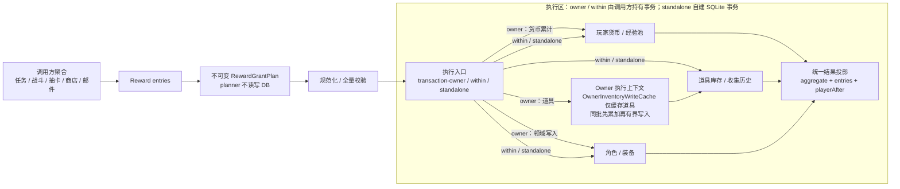
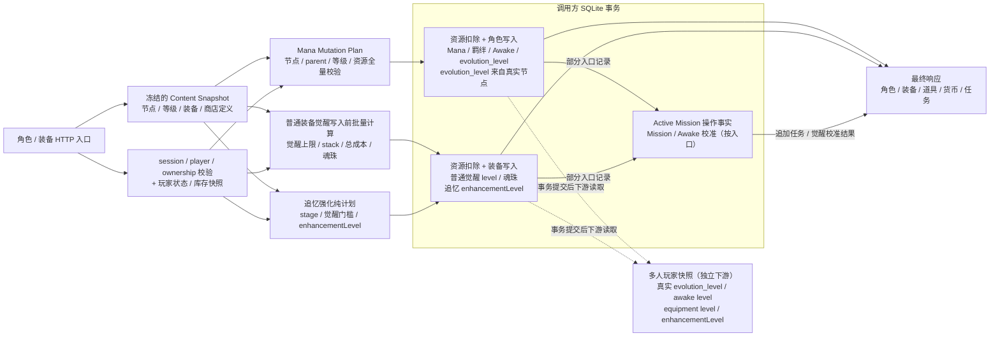

# StarPoint CN 奖励与养成

本页展示当前通用奖励写入边界，以及角色节点、普通装备觉醒和追忆强化的写前规划与事务写入关系。

## D4 当前奖励与库存写入

### 边界说明

- planner 规范化、校验并冻结 entries，不读写数据库；执行器在写入前再次校验整个 plan。
- `transaction-owner` 与 `within` 使用调用方已有事务，`standalone` 自建 SQLite 事务。
- owner 模式先累计货币和道具；`OwnerInventoryWriteCache` 只合并道具写入，不缓存角色、装备或货币。
- 角色、装备、道具和货币分别由领域写入器落库，再聚合为统一结果投影。

### 精简证据

| 图中事实 | 仓库相对证据路径 |
|---|---|
| planner 复制、校验并冻结奖励计划 | `src/lib/reward-grant/plan.ts` |
| 执行器提供 owner、within 和 standalone 事务入口 | `src/lib/reward-grant/executor.ts`、`src/lib/reward-grant/owner-executor.ts` |
| owner 模式先累计货币与道具再落库 | `src/lib/reward-grant/executor.ts` |
| 道具缓存按 item 合并增量并记录收集历史 | `src/lib/reward-grant/owner-inventory.ts` |
| entry 结果聚合为角色、装备、道具、货币和 `playerAfter` | `src/lib/reward-grant/executor.ts` |
| 战斗、任务、抽卡、商店和邮件调用 RewardGrant | `src/lib/quest/finish/single-settlement-reward-grant.ts`、`src/lib/mission/grants.ts`、`src/routes/api/gacha.ts`、`src/lib/shop-reward-grant.ts`、`src/lib/mail-reward-grant.ts` |

### 本图不表达

- 不展开奖励类型编号、具体奖励和重复获得补偿规则。
- 不展开各调用方的扣费、次数、领取状态和活动周期逻辑。
- 不表达异步队列、跨进程库存或未来事务协调器。

## D5 当前角色与装备养成

### 边界说明

- HTTP 入口先校验 session、player 和 ownership，并以 Content 定义及玩家状态/库存快照进行写前规划。
- 角色分支使用纯 Mana Mutation Plan；普通装备觉醒只在路由内批量计算，不视为独立纯 planner。
- 普通装备觉醒写 `level` 与魂珠，追忆强化写 `enhancementLevel`；两类等级语义不合并。
- 多人快照只在事务提交后读取持久成长状态，不参与养成事务或写入。

### 精简证据

| 图中事实 | 仓库相对证据路径 |
|---|---|
| 入口校验身份、所有权并读取玩家与库存快照 | `src/routes/api/character/mana.ts`、`src/routes/api/equipment.ts`、`src/routes/api/shop.ts` |
| Mana planner 校验节点、parent、等级和资源并输出冻结计划 | `src/lib/character-mana-mutation-plan.ts`、`src/lib/character-mana-mutation-validation.ts` |
| 角色事务扣资源并写节点、Awake 与真实进化等级 | `src/routes/api/character/mana.ts`、`src/routes/api/character/mana-awake.ts`、`src/lib/character-evolution.ts` |
| 普通装备觉醒在事务前批量计算并写 `level`、stack 与魂珠 | `src/routes/api/equipment.ts` |
| 追忆强化独立规划并只更新 `enhancementLevel` | `src/lib/equipment-enhancement.ts`、`src/routes/api/shop.ts` |
| 多人快照读取持久角色、节点和装备等级 | `src/multi/snapshot/player-snapshot.ts` |

### 本图不表达

- 不展开具体角色、节点、材料、装备、商店条目或魂珠 ID。
- 不把普通装备觉醒 `level`、追忆强化 `enhancementLevel`、节点 `awake_level` 与角色 `evolution_level` 合并。
- 不把普通装备觉醒的路由内计算描述为独立纯 planner。
- 不展开突破、EX 能力、装备出售、保护开关和配队编辑等其他成长入口。
