# 运行时启动与关闭当前架构

本文描述受支持 CN 启动入口、Content 前置条件、运行时组件顺序和有界关闭流程。宿主与服务端的外部契约见[嵌入式运行契约](../embedded-runtime-contract.md)。

## D9 当前启动与关闭生命周期

```mermaid
flowchart LR
    BUILD["build:server"]
    BOOT["start-cn.sh / bootstrap<br/>读取 ASSET_MODE"]
    SYNC{"Content Sync 条件"}
    CONFIG["冻结 RuntimeConfig"]
    DB["初始化 SQLite<br/>恢复全局时间"]
    CONTENT["加载 Content Snapshot<br/>与 modes.d"]
    MULTI["启动 Multi Runtime"]
    HTTP["配置并监听 Fastify HTTP"]
    READY["ready / health snapshot"]
    CLOSE["关闭 / 启动失败清理<br/>有界关闭 HTTP → 停止 Multi"]
    CLOSE_DB["checkpoint 并关闭 SQLite"]
    END["stopped 或 failed<br/>稳定退出码"]

    BUILD --> BOOT --> SYNC
    SYNC -->|"local：同步成功"| CONFIG
    SYNC -->|"local：同步失败，不启动"| END
    SYNC -->|"remote / client-owned：跳过同步"| CONFIG
    CONFIG --> DB --> CONTENT --> MULTI
    MULTI -->|"ready，或 host/client degraded"| HTTP --> READY
    MULTI -->|"embedded TCP 失败：清理启动残留"| CLOSE
    READY -->|"SIGINT / SIGTERM"| CLOSE --> CLOSE_DB --> END
```

资源模式和多人模式是两条独立配置轴。`local` 资源模式的同步失败会阻止服务启动；`remote` 与 `client-owned` 跳过本地同步。多人 `embedded` TCP 属于启动硬依赖，`host`/`client` 多人组件故障只进入可观测的 degraded 状态，不阻止游戏 HTTP 服务启动。

关闭流程先停止接收 HTTP，再停止 Multi/TCP/Hub，最后 checkpoint 并关闭 SQLite。每个外部关闭步骤都有边界时间；普通调试入口 `node out/cn-server.js` 不执行 Content 同步，因此不属于日常支持入口。

| 事实 | 证据 |
|---|---|
| 启动脚本先构建，再进入 Content bootstrap | `scripts/start-cn.sh`、`tools/start_cn.cjs` |
| local 同步成功后才启动服务，其他资源模式跳过同步 | `src/content/startup/bootstrap.ts` |
| RuntimeCoordinator 固定 DB/time、Content、Multi、HTTP 顺序 | `src/runtime/lifecycle.ts` |
| embedded 失败和 host/client degraded 的边界不同 | `src/runtime/lifecycle.ts` |
| 关闭顺序为 HTTP、Multi、SQLite | `src/runtime/lifecycle.ts` |
| 健康快照聚合数据库、Content、HTTP、Multi 和资源模式 | `src/runtime/lifecycle.ts` |

本图不展开 Runtime Pack、Server Bundle 和 Supervisor 的文件校验协议，也不表示 host/client 多人降级等同于整个游戏服务不可用。
