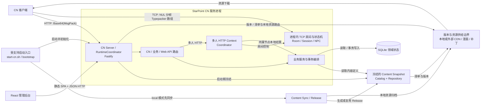

# StarPoint CN 系统总览

本页从系统边界展示当前运行时。完整启动链、协议和模块职责见[当前运行时架构](../architecture.md)。

## D1 当前系统总览

### 边界说明

- Content Snapshot 是启动期冻结的只读定义；玩家和业务状态由 SQLite 领域模块持久化。
- 多人 HTTP 由运行时 Context/Coordinator 接入，房间、TCP 连接和状态机保存在进程内。
- 多人结算回到玩家所属服务节点的业务服务与 SQLite；Hub 或房间状态不成为玩家数据库。
- 资源模式决定本地同步和资源供给路径，但不改变游戏 HTTP 与多人 TCP 的协议边界。

### 精简证据

| 图中事实 | 仓库相对证据路径 |
|---|---|
| local 模式先同步，成功后启动服务 | `src/content/startup/bootstrap.ts`、`scripts/start-cn.sh` |
| Fastify 组合游戏、管理与多人 HTTP 路由 | `src/cn-server.ts`、`src/multi/http/context.ts` |
| Content Snapshot 在启动期初始化并提供 Catalog/Repository | `src/content/runtime/content-snapshot.ts`、`src/cn-server.ts` |
| 游戏 HTTP 与多人 TCP 使用不同协议 | `src/cn-server.ts`、`docs/protocol/multi-battle.md` |
| SQLite 持久化领域状态，多人房间和 session 位于进程内 | `src/data/db.ts`、`src/multi/room/`、`src/multi/state/`、`src/multi/tcp/` |
| 版本、清单和本地资源路由读取当前 Content Snapshot | `src/routes/cn/asset-provider.ts` |

### 本图不表达

- 不展开多人 embedded、host、client 拓扑及 Hub 跨节点流程。
- 不展开任务、战斗、奖励、养成等业务事务内部。
- 不展开账号、双时钟、`/load`、进程关闭或部署配置细节。
