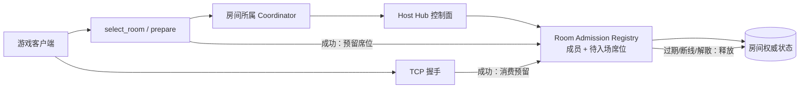

# 多人房间席位预留与加入失败语义

状态：Gate 37 方案 A，待实现

## 目标

在现有 `MultiCoordinator`、Host Hub 和 TCP admission 边界内，补齐多人房间从 HTTP 选择到 TCP 握手之间的席位预留，并恢复客户端可以识别的加入失败状态。

本次只处理房间容量和失败语义，不实现随机招募、公开大厅、跨重启恢复或新的跨节点房间迁移。

## 当前问题

当前 `AdmissionRegistry` 只保存快照 admission，不记录它占用的房间席位。房间成员在 TCP 握手成功后才写入 `member_participants`，因此多个服务端或多个客户端同时请求 `select_room` 时，可能都在 TCP 连接前通过检查。

同时，`select_room` 和 `prepare` 对已开始、已满、兼容性拒绝等情况使用了过于宽泛的 `raising_state=7`。国服客户端已经为房间已满、战斗已开始和房间不存在保留不同的状态分支，服务端应返回对应状态。

## 设计边界

1. 房间状态仍由 `EmbeddedMultiCoordinator` 或 Host Hub 所在的 Coordinator 持有。
2. Client 节点不根据自己的 SQLite 或本地在线人数猜测 Host 房间容量。
3. `select_room`/`prepare` 成功发放 admission 时，权威 admission registry 同时占用一个真人席位。
4. TCP 握手成功消费该 admission；超时、节点撤销、房间解散和明确失败路径释放它。
5. 已经是房间成员的重连请求保持幂等，不重复占用席位。
6. 现有 NPC 不计入真人席位预留；真人进入后仍由当前 NPC roster 规则补位。

## 加入失败状态

客户端响应继续使用现有 `raising_state` 字段，不新增客户端协议字段：

| 状态 | 语义 | 适用场景 |
|---:|---|---|
| `3` | 房间已满 | 成员和待入场 admission 已达到 3 个真人席位 |
| `4` | 战斗已开始 | 非原成员尝试加入 `raising_state=4` 的房间 |
| `7` | 当前不可加入 | 兼容性不一致、viewer 冲突、Hub 不可用等非房间存在性拒绝 |
| `9` | 房间不存在或已失效 | 查不到房间、房间已解散或 admission 已失效 |

`search_room` 继续使用现有 `4020` 兼容性拒绝和 `room_exists=false` 缺房语义。`restore_room` 对已有成员保持现有恢复分支，不把正常重连误报成房间已满。

内部 Coordinator 错误增加明确的 `ROOM_FULL`，由远程 Hub 原样传输到所属节点，再由 HTTP 层投影为 `raising_state=3`；它不进入玩家存档，也不作为客户端新增字段。

## 数据流

### 选择和预留

1. HTTP 路由按现有流程解析 viewer、兼容性和房间 locator。
2. Coordinator 查找房间并先检查兼容性与战斗状态。
3. 房间不存在返回 `ROOM_NOT_FOUND`；战斗已开始由 HTTP 层返回 `raising_state=4`。
4. 对可加入房间请求 admission registry 原子预留：
   - 统计当前真人成员；
   - 加上未过期的待入场 admission；
   - 同一 `nodeSessionId + viewerId` 的重复请求复用原 admission；
   - 超过三人返回 `ROOM_FULL`。
5. 预留成功后生成现有玩家快照和 admission，返回原有 TCP 地址与房间字段。

### TCP 消费

1. TCP 握手仍必须提供一次性 admission。
2. 握手成功前不写入房间成员；身份、房间、关卡和兼容性检查失败时释放本次预留。
3. 握手成功时消费 admission 并写入成员；后续网络断开仍沿用现有重连宽限与 NPC 规则。

### 清理

- admission TTL 到期时释放席位；
- 节点会话撤销时清理该节点全部 admission；
- 房间解散、过期或 Host 清理时清空房间 admission；
- TCP 握手异常、快照构建失败和重复身份冲突不得留下幽灵席位。

## 不改变的行为

- Host 玩家仍直接使用本地 Coordinator 和 TCP。
- Client 已存在的远程房间不因 Hub 探测失败而迁移。
- Hub 不读取或复制玩家完整存档，不负责奖励、体力、任务和库存写入。
- `ChangeAutoplayMode`、NPC 重赛 roster、战斗心跳租约和可靠发送队列保持当前实现。
- 不把网络失败解释成真实房间不存在；只有对客户端协议需要时才投影为对应的失效状态。

## 验证要求

自动测试至少覆盖：

1. 单服中两个并发 guest 选择同一房间时，最多一个可占用最后席位。
2. 两个 Client 节点通过同一 Host Hub 并发选择时，Host 仍按全局真人席位限制拒绝超额请求。
3. admission 过期或 TCP 握手失败后，席位可以再次被其他玩家使用。
4. 同一成员重连不重复占位，跨节点相同 viewer 仍返回冲突。
5. 房间已满返回 `raising_state=3`，战斗已开始返回 `4`，缺房返回 `9`，兼容性拒绝保持 `7`。
6. 房间解散、Hub 节点撤销和本地 fallback 切换后不残留 admission。
7. 现有多人/HUB 专项回归和双服自动 runner 的行为签名保持不变。

